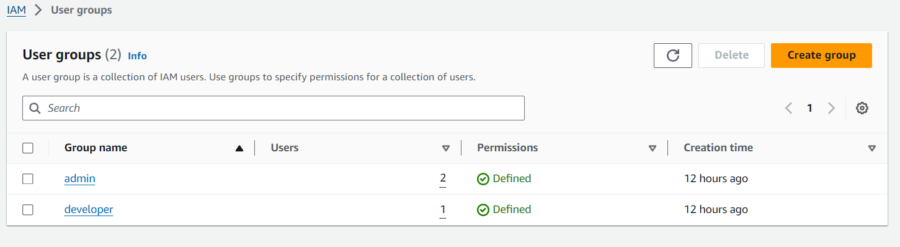
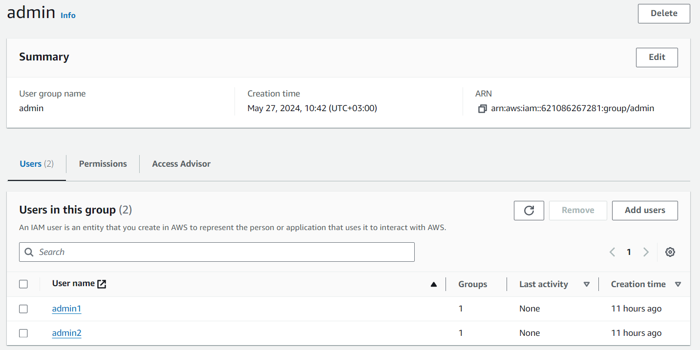
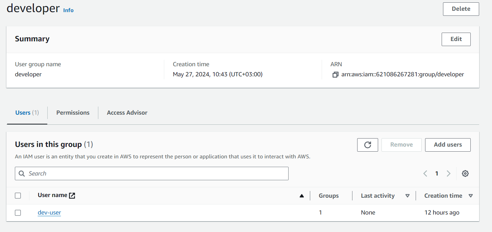
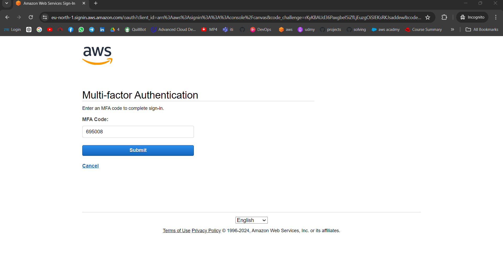
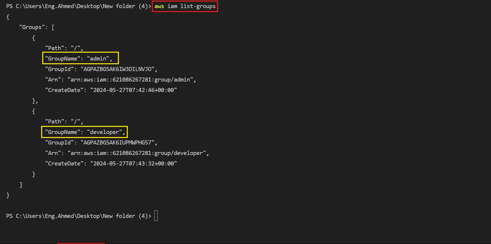
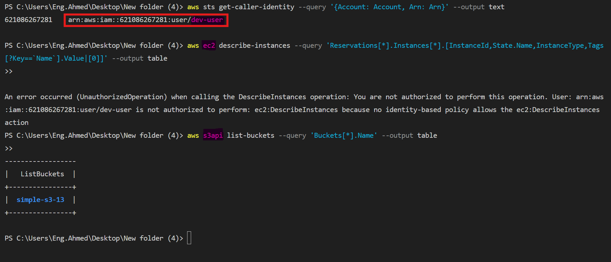
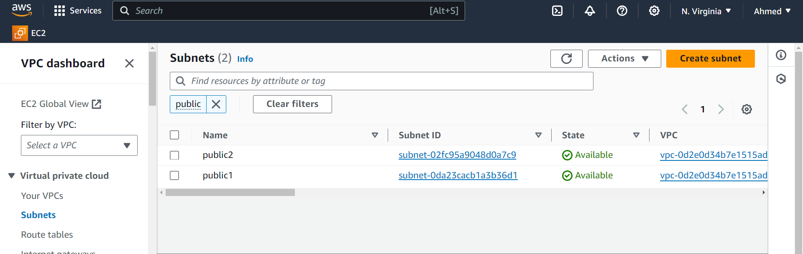
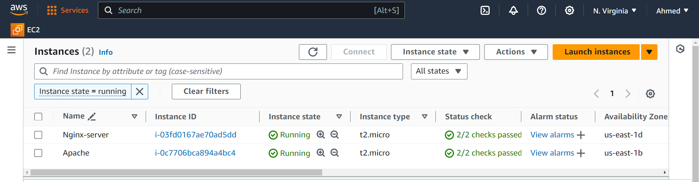
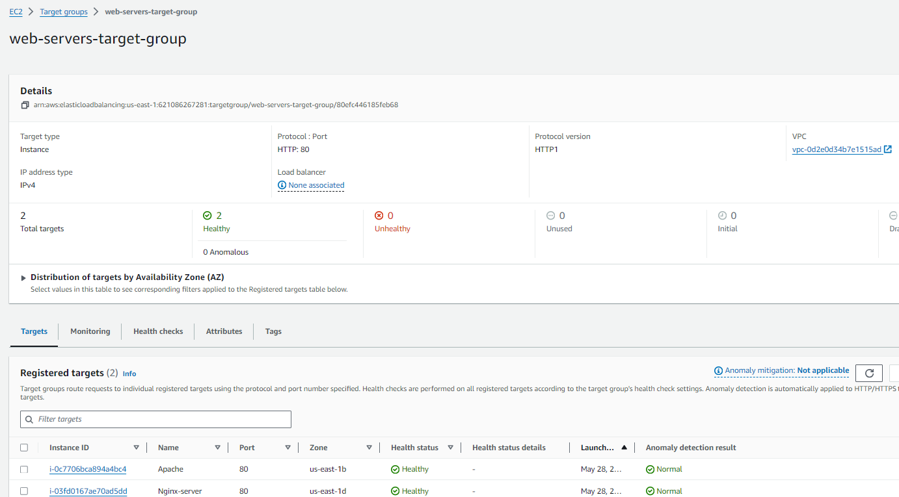

## Lab 19: AWS Security

### Objective:
This lab focuses on setting up a secure AWS environment by creating user groups, managing user permissions, and ensuring proper access control. The main tasks include:

1. Creating an AWS account.
2. Creating two IAM groups (admin and developer).
3. Configuring user access as per the specified requirements
4. Listing all users and groups using AWS CLI commands.
5. Taking screenshots to document EC2 and S3 access.


---
### 1. Create IAM Groups
    1-Open the IAM console and click on User groups in the left-hand navigation pane.
    2-Create group and enter the group name admin.
    3-Attach the AdministratorAccess policy to this group.
    4-Click Create group again and enter the group name developer.
    5-Attach a policy that provides S3 access only (AmazonS3FullAccess).


### 2. Create IAM Users and Assign Permissions
Click Add user and create the following users with specified access 
    1. admin1
        Select AWS Management Console access only.
        Enable Require MFA.
        Assign this user to the admin group.
    2. admin2 
        Select Programmatic access only.
        Assign this user to the admin group.  



    3. dev-user
        Select both AWS Management Console access and Programmatic access.
        Assign this user to the developer group.


### 3. Verify IAM Users 
    1. admin1 with MFA


---



---
    2. admin2 List All Groups Using CLI Commands
    
```bash
    aws iam list-groups
```



    3. dev-user Verify Access for s3 and ec2 

using cli 
 show the account id and user , show all ec2 and  show all s3
```bash
aws sts get-caller-identity --query '{Account: Account, Arn: Arn}' --output text
aws ec2 describe-instances --query 'Reservations[*].Instances[*].[InstanceId,State.Name,InstanceType,Tags[?Key==`Name`].Value|[0]]' --output table
ws s3api list-buckets --query 'Buckets[*].Name' --output table
```



---


## Lab 20: Launching an EC2 Instance

### Objective

Create a private subnet and launch an EC2 instance. Configure security groups and connect to the instance using a bastion host.

***
### Steps to Complete the Lab

#### 1. Set Up the VPC and Subnet
    1. Create a VPC:

        Go to the AWS Management Console.
        Navigate to the VPC dashboard.
        Click on "Create VPC".
        create Private Subnet
        Provide a name and CIDR block 

    2. Create Subnets:

    In the VPC dashboard, click on "Subnets".
    Click on "Create subnet".
    Select your VPC and provide a subnet name (e.g., Private Subnet).

#### 2. Launch the EC2 Instance
    Launch an Instance:
       
        Choose an Amazon Machine Image (AMI)and Select an instance type.
        Select the VPC and the private subnet created earlier.
        Ensure "Auto-assign Public IP" is disabled (for Private ec2).
        Ensure "Auto-assign Public IP" is enable (for Bastion-server ec2).
        Configure a security group to allow traffic (e.g., SSH from the bastion host and the same for Private ).
***

***
#### 3. Configure the Security Groups
Create a Security Group for the EC2 Instance:

    another security group (BastionHostSG).
    Add an inbound rule to allow SSH from your IP (or a range of IPs). allow prot 22 for ssh.
***

***
#### 4. Connect to the Instances
1. Connect to the Bastion Host:
    ```bash
        scp -i "host1.pem" host1.pem ubuntu@ec2-52-87-170-249.compute-1.amazonaws.com:/home/ubuntu/
        ssh -i host1.pem ec2-user@bastion-host-public-ip
    ```
using scp for key to using the key 
2. Connect to the Private Instance via the Bastion Host:
    ```bash
    ssh -i path/to/key.pem ec2-user@private-instance-private-ip
        ```

***
Bastion-ssh


***
private-ssh.png


***

## lab 21: AWS Load Balancer Lab

### Objective:
Create a Virtual Private Cloud (VPC) with 2 subnets, launch 2 EC2 instances (one with Nginx and the other with Apache installed), and create and configure a Load Balancer to access the web servers.

### Prerequisites:
- AWS account
- Basic understanding of AWS service (VPC, EC2, Load Balancers)
- AWS CLI installed and configured (optional but helpful)

### Steps:
#### **Step 1: Create a VPC with 2 Subnets**
Create a VPC:

1- Click on "Create VPC".
    Name your VPC (e.g., my-vpc).
    Choose an IPv4 CIDR block (e.g., 10.0.0.0/16).
    Create the VPC.

2- Create Subnets:
    Go to the Subnets section.
    create two subnets (, subnet-1 and subnet-2).
    Assign the first subnet to the first Availability Zone (e.g., 10.0.1.0/24).
    Assign the second subnet to the second Availability Zone (e.g., 172.31.3.0/24).
    Create the subnets.



---
#### **Step 2: Step 2: Launch EC2 Instances**

1- Launch EC2 Instances:
   - Click "Launch Instance".
   - Choose an AMI (e.g., Ubuntu Server 20.04 LTS).
   - Select an instance type (e.g., t2.micro).
   - In the Configure Instance step, make - sure to assign the instances to the correct subnets (subnet-1 and subnet-2).

2- Add User Data:
    In  "Advanced Details" section.
    Add the following user data scripts:
- Nginx User Data for the first instance (in subnet-1): 

```bash
        #!/bin/bash
        apt-get update
        apt-get install -y nginx
        systemctl start nginx
        systemctl enable nginx
        systemctl status nginx
```
- Apache User Data for the second instance (in subnet-2):

```bash
    #!/bin/bash
    apt-get update
    apt-get install -y apache2
    systemctl start apache2
    systemctl enable apache2
    systemctl status apache2
``` 



---
3- Configure Security Groups:
    Create or select a security group that allows HTTP (port 80) , SSH (port 22) access and HTTPs (port 443) .
    Assign this security group to both instances.

#### **Step 3: Create and Configure a Load Balancer**

1- Create a Load Balancer:
    Click "Create Load Balancer".
    Select "Application Load Balancer".
    Name your load balancer (e.g., my-alb).
    Select internet-facing as the scheme.
    Add listeners (e.g., HTTP on port 80).

2- Configure the Load Balancer:
    Select the VPC created in Step 1.
    Add both subnets (subnet-1 and subnet-2).

3- Configure Security Groups:
    Create or select a security group that allows HTTP (port 80) access.
    Assign this security group to the load balancer.

4- Configure Routing:
    Create a new target group ( my-targets-web-servers).
    Set the target type to instance.
    Choose the protocol as HTTP and port 80.

5- Register Targets:
    Add the EC2 instances created in Step 2 as targets.
    then create load blalncer



---

the Resource map-LB for LB is like 


#### **Step 4: Test the Setup**

Get the DNS Name of the Load Balancer:
   - Go to the Load Balancer section in the EC2 dashboard.
   - Copy the DNS name of the created load balancer.

   <video controls src="screenshot/lab21-DNS-LB.mov" title="Title"></video>