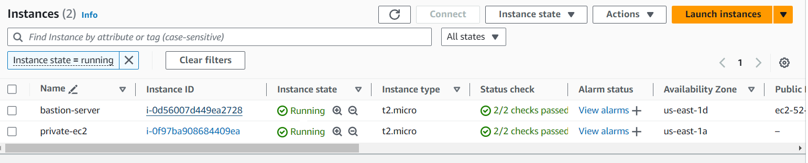
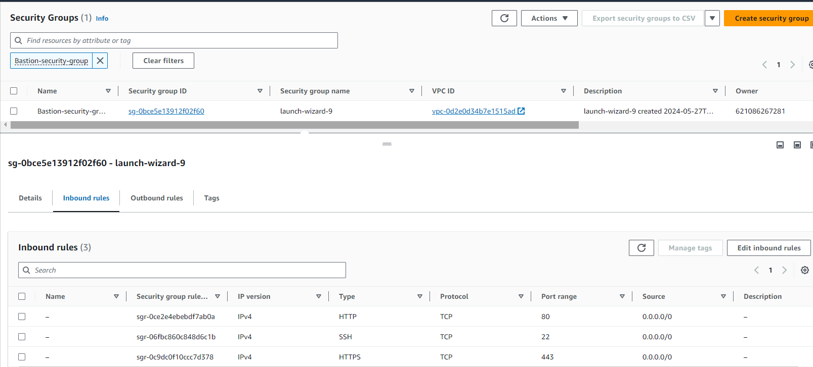
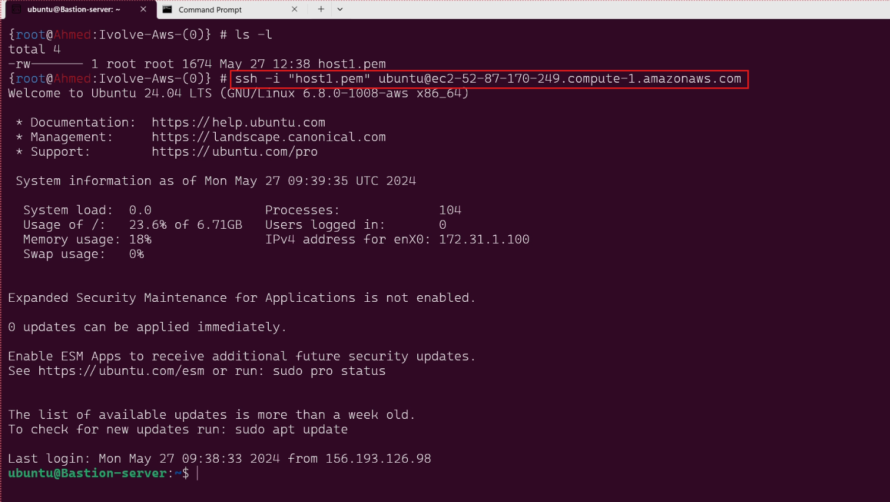
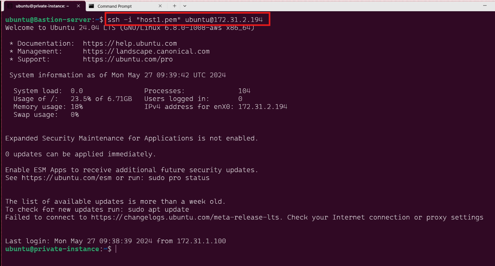

## Lab 20: Launching an EC2 Instance

### Objective

Create a private subnet and launch an EC2 instance. Configure security groups and connect to the instance using a bastion host.

***
### Steps to Complete the Lab

#### 1. Set Up the VPC and Subnet
    1. Create a VPC:

        Go to the AWS Management Console.
        Navigate to the VPC dashboard.
        Click on "Create VPC".
        create Private Subnet
        Provide a name and CIDR block 

    2. Create Subnets:

    In the VPC dashboard, click on "Subnets".
    Click on "Create subnet".
    Select your VPC and provide a subnet name (e.g., Private Subnet).

#### 2. Launch the EC2 Instance
    Launch an Instance:
       
        Choose an Amazon Machine Image (AMI)and Select an instance type.
        Select the VPC and the private subnet created earlier.
        Ensure "Auto-assign Public IP" is disabled (for Private ec2).
        Ensure "Auto-assign Public IP" is enable (for Bastion-server ec2).
        Configure a security group to allow traffic (e.g., SSH from the bastion host and the same for Private ).
***

***
#### 3. Configure the Security Groups
Create a Security Group for the EC2 Instance:

    another security group (BastionHostSG).
    Add an inbound rule to allow SSH from your IP (or a range of IPs). allow prot 22 for ssh.
***

***
#### 4. Connect to the Instances
1. Connect to the Bastion Host:
    ```bash
        ssh -i host1.pem ec2-user@bastion-host-public-ip

    ```
2. Connect to the Private Instance via the Bastion Host:
    ```bash
    ssh -i path/to/key.pem ec2-user@private-instance-private-ip
        ```

***
Bastion-ssh
***

***
private-ssh.png
***
