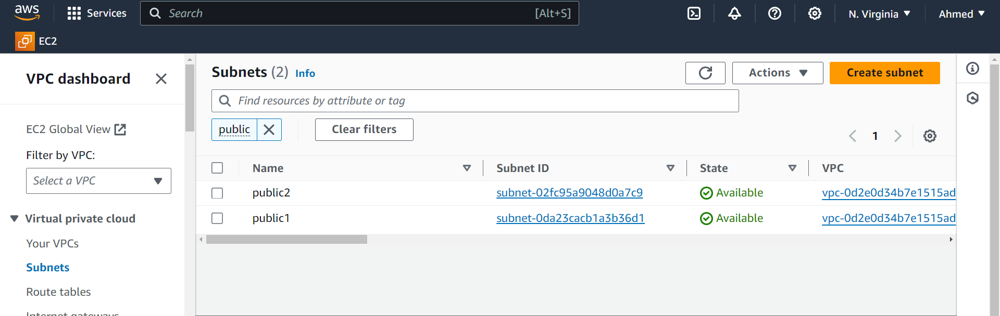
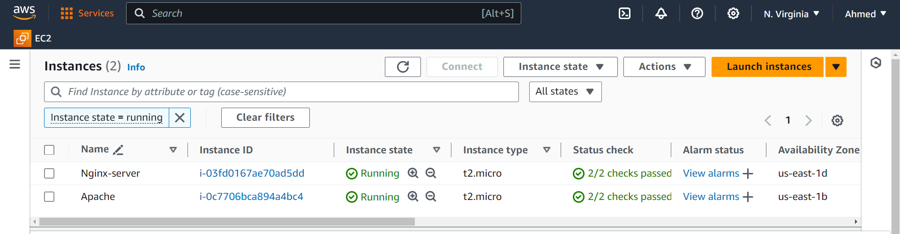
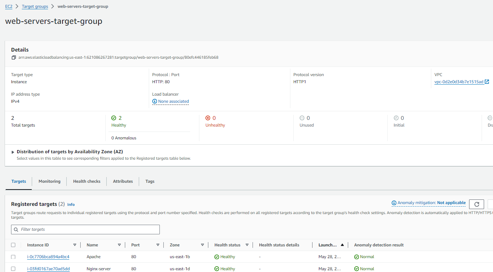
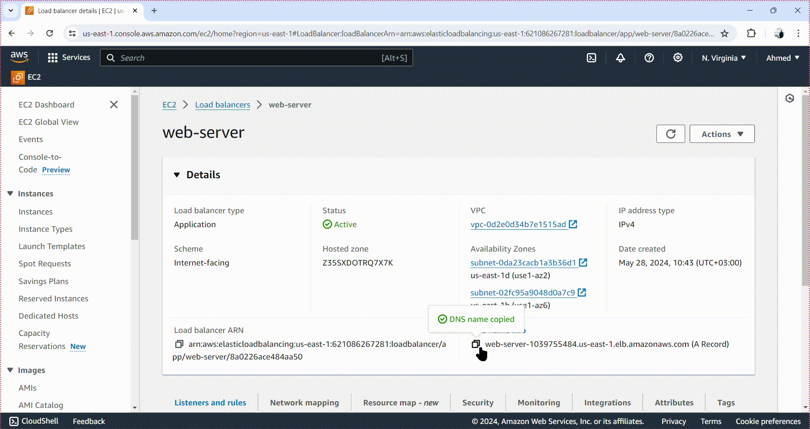

## lab 21: AWS Load Balancer Lab

### Objective:
Create a Virtual Private Cloud (VPC) with 2 subnets, launch 2 EC2 instances (one with Nginx and the other with Apache installed), and create and configure a Load Balancer to access the web servers.

### Prerequisites:
- AWS account
- Basic understanding of AWS service (VPC, EC2, Load Balancers)
- AWS CLI installed and configured (optional but helpful)

### Steps:
#### **Step 1: Create a VPC with 2 Subnets**
Create a VPC:

1- Click on "Create VPC".
    Name your VPC (e.g., my-vpc).
    Choose an IPv4 CIDR block (e.g., 10.0.0.0/16).
    Create the VPC.

2- Create Subnets:
    Go to the Subnets section.
    create two subnets (, subnet-1 and subnet-2).
    Assign the first subnet to the first Availability Zone (e.g., 10.0.1.0/24).
    Assign the second subnet to the second Availability Zone (e.g., 172.31.3.0/24).
    Create the subnets.



---
#### **Step 2: Step 2: Launch EC2 Instances**

1- Launch EC2 Instances:
   - Click "Launch Instance".
   - Choose an AMI (e.g., Ubuntu Server 20.04 LTS).
   - Select an instance type (e.g., t2.micro).
   - In the Configure Instance step, make - sure to assign the instances to the correct subnets (subnet-1 and subnet-2).

2- Add User Data:
    In  "Advanced Details" section.
    Add the following user data scripts:
- Nginx User Data for the first instance (in subnet-1): 

```bash
        #!/bin/bash
        apt-get update
        apt-get install -y nginx
        systemctl start nginx
        systemctl enable nginx
        systemctl status nginx
```
- Apache User Data for the second instance (in subnet-2):

```bash
    #!/bin/bash
    apt-get update
    apt-get install -y apache2
    systemctl start apache2
    systemctl enable apache2
    systemctl status apache2
``` 



---
3- Configure Security Groups:
    Create or select a security group that allows HTTP (port 80) , SSH (port 22) access and HTTPs (port 443) .
    Assign this security group to both instances.

#### **Step 3: Create and Configure a Load Balancer**

1- Create a Load Balancer:
    Click "Create Load Balancer".
    Select "Application Load Balancer".
    Name your load balancer (e.g., my-alb).
    Select internet-facing as the scheme.
    Add listeners (e.g., HTTP on port 80).

2- Configure the Load Balancer:
    Select the VPC created in Step 1.
    Add both subnets (subnet-1 and subnet-2).

3- Configure Security Groups:
    Create or select a security group that allows HTTP (port 80) access.
    Assign this security group to the load balancer.

4- Configure Routing:
    Create a new target group ( my-targets-web-servers).
    Set the target type to instance.
    Choose the protocol as HTTP and port 80.

5- Register Targets:
    Add the EC2 instances created in Step 2 as targets.
    then create load blalncer



---

the Resource map-LB for LB is like 


#### **Step 4: Test the Setup**

Get the DNS Name of the Load Balancer:
   - Go to the Load Balancer section in the EC2 dashboard.
   - Copy the DNS name of the created load balancer.

