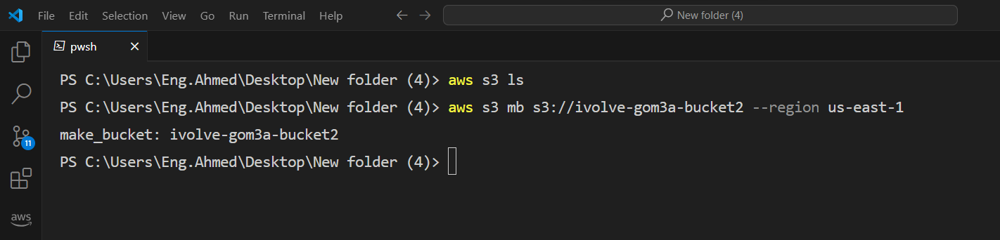
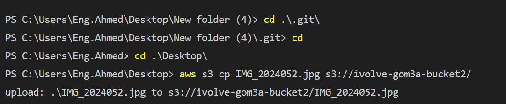
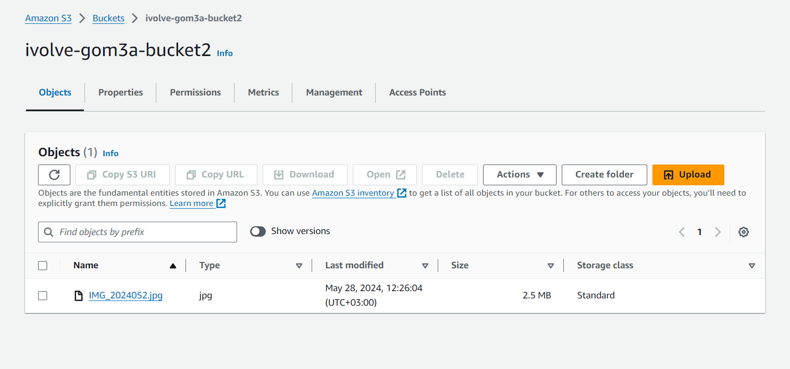
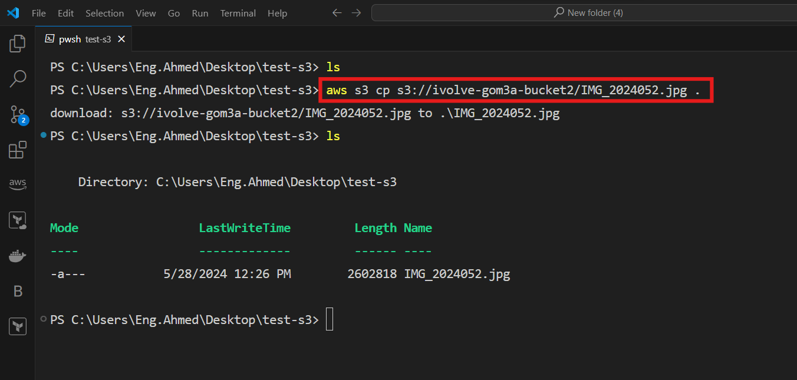

# Lab 22: SDK and CLI Interactions

## Objective:

The objective of this lab is to use the AWS Command Line Interface (CLI) to perform various operations with an Amazon S3 bucket. This includes creating the bucket, configuring permissions, uploading and downloading files, and enabling versioning and logging for the bucket.
### Benefits of Versioning
    Data Protection: Versioning keeps multiple versions of each object, allowing easy recovery from accidental deletions and overwrites.
    Backup and Restore: Ensures that historical versions of data are always available, supporting robust backup and disaster recovery strategies.
### Benefits of Logging
    Activity Monitoring: Logging tracks who accessed your data and when, providing visibility into user activity and operations.
    Security and Compliance: Detailed logs help identify unauthorized access and support audit trails for regulatory compliance.

## Steps Completed
### 1. Creating an S3 Bucket

Created a new S3 bucket named ivolve-gom3a-bucket2 using the following command:
```bash
aws s3 mb s3://ivolve-gom3a-bucket2 --region us-east-1
```




### 2. Configuring Permissions
Set up a bucket policy to allow public read access to the objects in the bucket. Created a JSON policy file (bucket-policy.json) with the following content

```json
{
    "Version": "2012-10-17",
    "Statement": [
        {
            "Effect": "Allow",
            "Principal": "*",
            "Action": "s3:GetObject",
            "Resource": "arn:aws:s3:::ivolve-gom3a-bucket2/*"
        }
    ]
}

```
Applied the policy using:

```bash 
aws s3api put-bucket-policy --bucket ivolve-gom3a-bucket2 --policy file://bucket-policy.json
```

###  3. Uploading Files to the Bucket
```bash
aws s3 cp IMG_2024052 s3://ivolve-gom3a-bucket2/
```


Verify in the console of AWS



### 4. Downloading Files from the Bucket
Downloaded a file named IMG_2024052.jpg from the bucket to the local directory:
```bash
aws s3 cp s3://ivolve-gom3a-bucket2/IMG_2024052.jpg .
```




### 5. Enabling Versioning
Enabled versioning for the bucket using:

```bash
aws s3api put-bucket-versioning --bucket ivolve-gom3a-bucket2 --versioning-configuration '{"Status":"Enabled"}'
```

### 6. Enabling Logging

Configured logging for the bucket by creating a JSON configuration file (logging.json) in onther Bucket with the following content:
```json
{
    "LoggingEnabled": {
        "TargetBucket": "ivolve-gom3a-bucket",
        "TargetPrefix": "logs/"
    }
}
```
apply the file in s3 with the following command:
```bash
aws s3api put-bucket-logging --bucket ivolve-gom3a-bucket2 --bucket-logging-status file://logging.json
```

### 7. Deleting the Bucket 
Deleted all objects and versions within the bucket to prepare for bucket deletion:
```bash
aws s3 rm s3://ivolve-gom3a-bucket2 --recursive
```
Then deleted the bucket itself:
```bash
aws s3 rb s3://ivolve-gom3a-bucket2
```

### Summary
In this lab, I successfully performed several critical S3 operations using the AWS CLI, including creating and configuring a bucket, managing files, and setting up versioning and logging. This exercise helped deepen my understanding of S3 and the AWS CLI, and demonstrated the practical application of these tools in managing cloud storage resources.