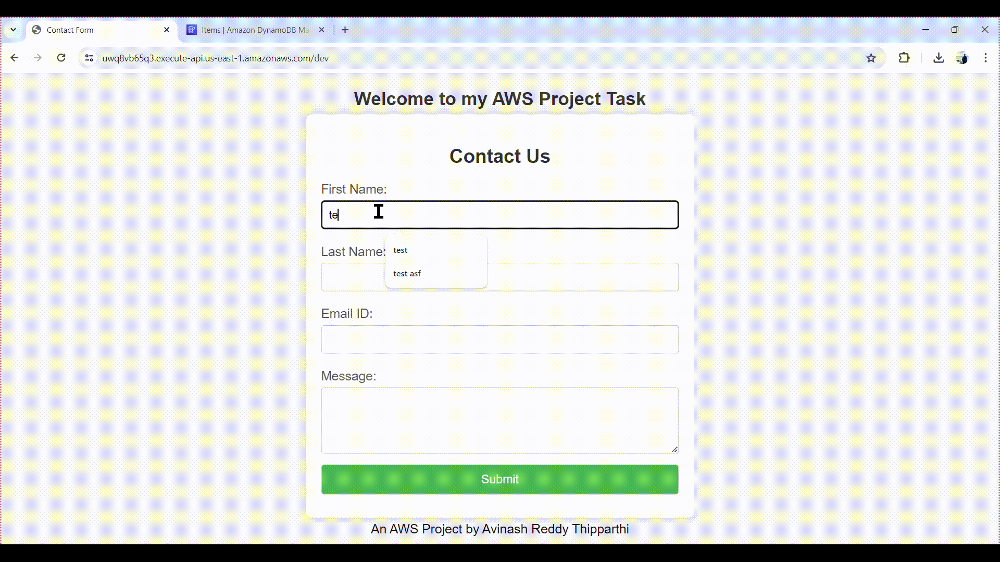

# Lab 23: Serverless Application Development

## Objective
The objective of this lab is to build a serverless application using AWS Lambda, API Gateway, and DynamoDB.

---

---

## 1. Setting Up DynamoDB
### Create a DynamoDB Table:
    - Navigate to the DynamoDB service and  "Create table".
    - Enter avinshtable for the table name (relative to the table in the python code will send to ).
    - Set the primary key as id with type String (email).
    - Configure the read and write capacity settings as needed then Click "Create".

## 2. Creating an AWS Lambda Function and assign role
### 1- Create a Lambda Function:
- assign role to can execution and full access for Dynamodb

- Navigate to the Lambda service and Click on "Create function".
- Choose "Author from scratch".
- Enter ivolve-Lambda for the function name.
- Choose the runtime (Python 3.8).
- Choose or create an execution role with the necessary permissions to interact with DynamoDB.
- Click "Create function".
- Add Function Code files with ivolve.zip for lambda function

## 3. Setting Up API Gateway
### 1- Create a REST API:
    Open the AWS Management Console and navigate to the API Gateway service.
    Click on "Create API".
    Choose "REST API" and click "Build".
    Enter a name for your API (ivolve-api) and click "Create API".

### 2- Create Resources and Methods:
#### Create a POST method from lambda function :
    Select the items resource and click "Create Method".
    Choose POST from the dropdown and click the checkmark.
    Select "Lambda Function" for the integration type.
    Check the box for "Use Lambda Proxy integration".
    Enter the Lambda function name (ivolve-Lambda) and click "Save".
    Confirm the function's ARN and permissions.
#### Create a GET method for the items resource:
    Select the items resource and click "Create Method".
    Choose GET from the dropdown and click the checkmark.
    Select "Lambda Function" for the integration type.
    Check the box for "Use Lambda Proxy integration".
    Enter the Lambda function name (ivolve-Lambda) and click "Save".
    Confirm the function's ARN and permissions.

### 3- Deploy the API:
    Click on "Actions" and select "Deploy API".
    Create a new deployment stage (e.g., dev) and click "Deploy".

    use the Invoke url to can access the web 

## the video shown the web with the DynmaoDB  

