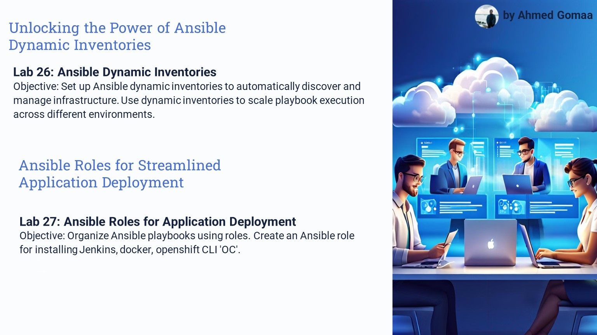

# Solution of Ansible labs (26, 27)

***

## Ansible Labs

| Lab Number | Lab Title                                                                                                        | Link                                                                                         |
|------------|------------------------------------------------------------------------------------------------------------------|----------------------------------------------------------------------------------------------|
| Lab 26     | 📜 Ansible Dynamic Inventories                                                 | [ Ansible Dynamic Inventories](https://github.com/gAhmedg/ivolve-traning/tree/main/ansible-role-and-Dynamic-inventory/lab26) |
| Lab 27     | ⚙️ Ansible Roles for Application Deployment                                   | [Ansible Roles for Application Deployment](https://github.com/gAhmedg/ivolve-traning/tree/main/ansible-role-and-Dynamic-inventory/lab27) |

