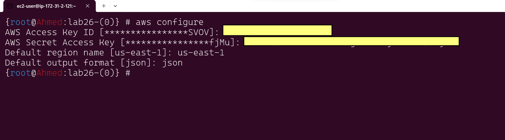
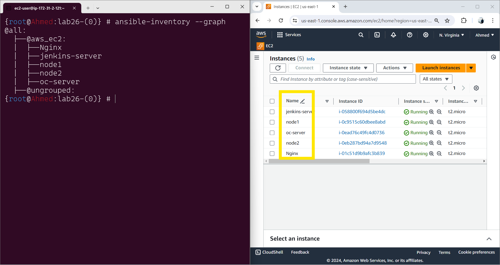
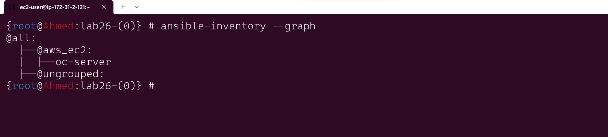
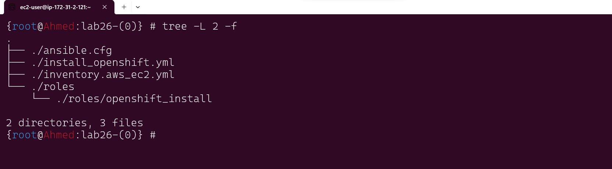
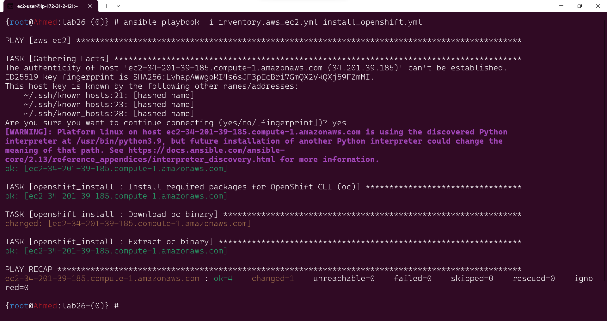
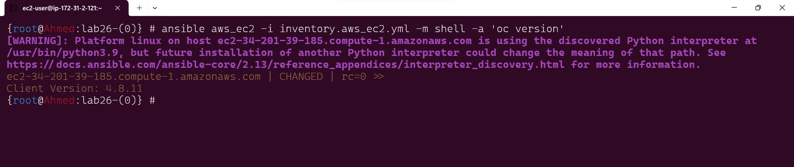

# Lab 26: Ansible Dynamic Inventories


##  Objective
The objective of this lab is to set up Ansible dynamic inventories to automatically discover and manage infrastructure. By the end of this lab, you will be able to use dynamic inventories to scale playbook execution across different environments.

## Prerequisites
Before starting this lab, ensure you have the following:

- Ansible installed on your local machine.
- Basic knowledge of Ansible playbooks and inventories.
- Access to a cloud provider or infrastructure where you can deploy resources (e.g., AWS, Azure, GCP) we will use AWS.

## Lab Setup

### 1-Install Necessary Ansible Collections and Plugins

Make sure you have the required collections and plugins installed. For example, if you're using AWS:

```bash
pip install boto3 botocore
    
```
### 2-Configure Cloud Provider Access

Set up your environment to access your cloud provider. For AWS, you need to configure your AWS credentials:
```bash
aws configure
```



## Steps to Complete the Lab
### Step 1: Configure the Dynamic Inventory Plugin
Ansible supports dynamic inventory through various plugins. For AWS, you can use the aws_ec2 plugin. First, create a configuration file for the plugin.
1- Edit the ansible.cfg to enable plugins
```yml
# ansible.cfg
[defaults]
remote_user = ec2-user
inventory = inventory.aws_ec2.yml
[inventory]
enable_plugins = aws_ec2
```
2- Create a  your inventory configuration if it doesn't already exist and then configuration file named inventory.aws_ec2.yml as inventory  with the following content:
```yml
# inventory.aws_ec2.yml
plugin: aws_ec2
regions:
  - us-east-1
filters:
  instance-state-name: running
hostnames:
     - tag:Name
```
we can show the target hosts in Dynamic inventory using command 
```bash
ansible-inventory --graph
```


we using the filter section in inventory.aws_ec2.yml to select which instances  run playbook
```yml
#  update the inventory.aws_ec2.yml

plugin: aws_ec2
regions:
  - us-east-1
filters:
  instance-state-name: running
  tag:Name: oc-server
```


***
### Step 2: Create and Run an Ansible Playbook
From lab26 we use the role to install oc cli 
for configure role using ansible-galaxy
Role Directory:
    Create the role directory structure using the following command for each role
```bash
ansible-galaxy init jenkins_docker
```
Navigate to the tasks directory within your role in the main.yml file to include tasks for installing OpenShift CLI.


```yml
# roles/openshift_install/tasks/main.yml
---
- name: Install required packages for OpenShift CLI (oc)
  yum:
    name: 
      - yum-utils
      - wget
      - tar
    state: present

- name: Download oc binary
  get_url:
    url: "https://mirror.openshift.com/pub/openshift-v4/clients/oc/latest/linux/oc.tar.gz"
    dest: "/tmp/oc.tar.gz"

- name: Extract oc binary
  command: "tar -xf /tmp/oc.tar.gz -C /usr/local/bin/"
  args:
    creates: /usr/local/bin/oc
```
#### the structure for the project is like this




### Step 3: run the role in the target host 
```bash
 ansible-playbook -i inventory.aws_ec2.yml install_openshift.yml
```



### Step 4: Verify  the installation of oc cli  
```bash
ansible aws_ec2 -i inventory.aws_ec2.yml -m shell -a 'oc version'
```


***

## Conclusion
By completing this lab, you have set up Ansible dynamic inventories to automatically discover and manage your infrastructure. This allows for more efficient and scalable playbook execution across different environments.

## References
- [Ansible Documentation: Dynamic Inventory](https://docs.ansible.com/ansible/latest/user_guide/intro_dynamic_inventory.html)
- [Ansible AWS EC2 Inventory Plugin](https://docs.ansible.com/ansible/latest/collections/amazon/aws/aws_ec2_inventory.html)
- [AWS CLI Configuration](https://docs.aws.amazon.com/cli/latest/userguide/cli-configure-files.html)


