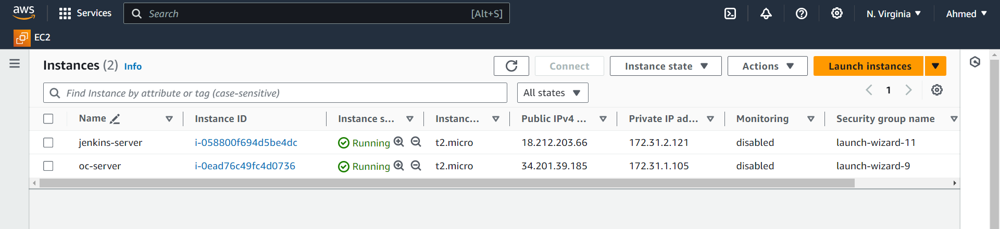
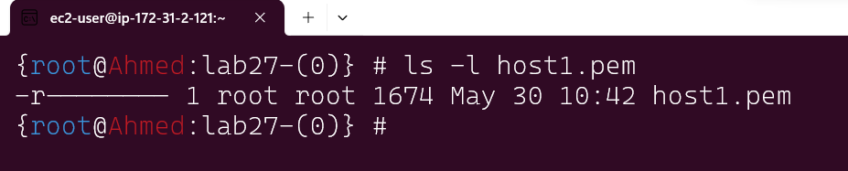
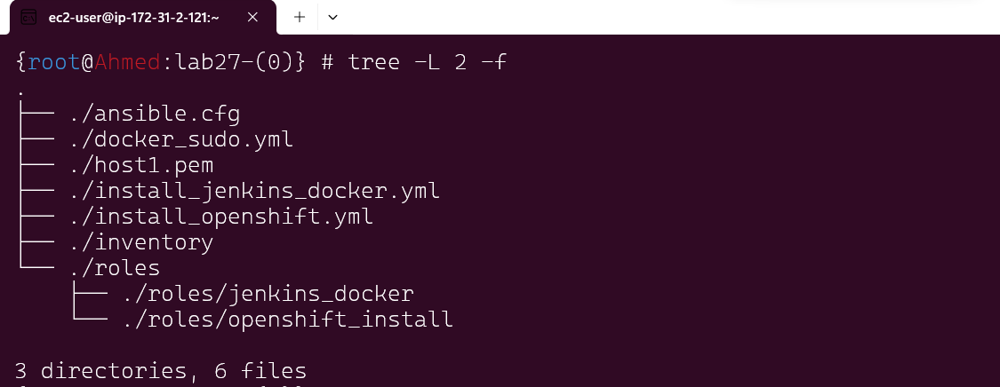
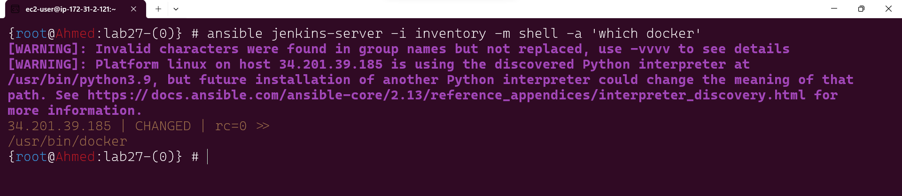
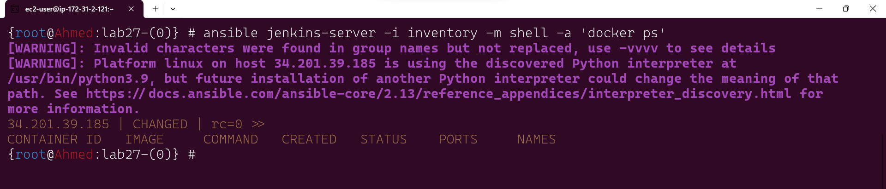
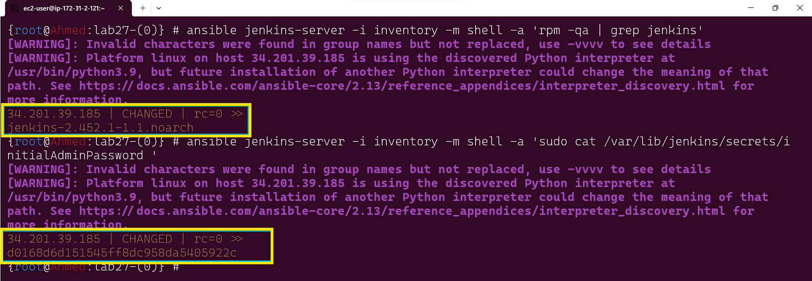

# Lab 27: Ansible Roles for Application Deployment


## Objective

The primary objective of this lab is to organize Ansible playbooks using roles. You will create an Ansible role for deploying Jenkins, Docker, and OpenShift CLI (oc) and reuse this role in different scenarios. This approach promotes reusability and modularity in Ansible playbook design, enhancing maintainability and scalability.

## Prerequisites

Before starting this lab, ensure you have the following:

- Ansible installed on your local machine or control node.
- Access to an AWS account with necessary permissions to manage EC2 instances.
- SSH key pair for accessing the EC2 instances .
- Basic understanding of Ansible, including playbooks and roles.
- Familiarity with SSH and basic Linux commands.

## Lab Setup
### Step 1: Setting Up AWS Environment
1- Launch EC2 Instances:
    Launch one or more EC2 instances in your preferred AWS region. Ensure the instances are running a Linux distribution compatible with Jenkins, Docker, and OpenShift CLI (e.g., Amazon Linux, Ubuntu).



2- Configure Security Group:
    Ensure that the security group associated with your EC2 instances allows inbound SSH (port 22), jenkins (port 8080),HTTPs (port 443) and HTTP (port 80) traffic, as well as any other necessary ports for Jenkins and Docker.

3- SSH Access:
    Ensure your SSH private key file has the correct permissions:
```bash
    chmod 400 host1.pem
```


4- make ansible host as authorized:
```basg
scp -i <yourkey.pem> /root/.ssh/id_rsa.pub  <user>@<ip-of-your-machine>:~/.ssh/authorized_keys
```

## Creating the Ansible Role
### Step 2: Create Directory Structure for the Role

Role Directory:
    Create the role directory structure using the following command for each role
```bash
ansible-galaxy init jenkins_docker
ansible-galaxy init openshift_install
```
the directory structure displayed in a for each role 

    jenkins_docker                                      openshift_install
    ├── README.md                                       ├── README.md
    ├── defaults                                        ├── defaults
    │   └── main.yml                                    │   └── main.yml
    ├── files                                           ├── files
    ├── handlers                                        ├── handlers
    │   └── main.yml                                    │   └── main.yml
    ├── meta                                            ├── meta
    │   └── main.yml                                    │   └── main.yml
    ├── tasks                                           ├── tasks
    │   └── main.yml                                    │   └── main.yml
    ├── templates                                       ├── templates
    ├── tests                                           ├── tests
    │   ├── inventory                                   │   ├── inventory
    │   └── test.yml                                    │   └── test.yml
    └── vars                                            └── vars
        └── main.yml                                        └── main.yml
**then the total files shown as**


### Step 3: Define Tasks and Handlers
1- Tasks using role:
Navigate to the tasks directory within your role in the main.yml file to include tasks for installing Jenkins, Docker, and OpenShift CLI.
Define handlers in the handlers/main.yml file to restart services if any configuration changes.
the Tasks and Handlers for jenkins docker show as below
```yml
# roles/jenkins_docker/tasks/main.yml
---
- name: Update all packages to the latest version
  yum:
    name: "*"
    state: latest

- name: Install required dependencies
  yum:
    name: 
      - git
      - yum-utils
    state: present

# Install OpenJDK 11
- name: Add Amazon Corretto repository
  yum_repository:
    name: corretto
    description: Amazon Corretto
    baseurl: https://yum.corretto.aws
    gpgcheck: yes
    gpgkey: https://yum.corretto.aws/corretto.key
    state: present

- name: Install Amazon Corretto 11 (OpenJDK 11)
  yum:
    name: java-11-amazon-corretto-devel
    state: present


# Install Jenkins
- name: Add Jenkins repository
  yum_repository:
    name: jenkins
    description: Jenkins
    baseurl: http://pkg.jenkins.io/redhat-stable
    gpgcheck: yes
    gpgkey: http://pkg.jenkins.io/redhat-stable/jenkins.io.key
    state: present

- name: Install Jenkins
  yum:
    name: jenkins
    state: latest

- name: Start and enable Jenkins service
  systemd:
    name: jenkins
    state: started
    enabled: yes

# Install Docker using yum package manager
- name: Add Docker repository
  yum_repository:
    name: docker
    description: Docker CE Stable - x86_64
    baseurl: https://download.docker.com/linux/centos/7/x86_64/stable
    gpgcheck: yes
    gpgkey: https://download.docker.com/linux/centos/gpg
    state: present

- name: Install Docker
  yum:
    name: 
      - docker-ce
      - docker-ce-cli
      - containerd.io
    state: present

- name: Start and enable Docker service
  systemd:
    name: docker
    state: started
    enabled: yes

```

and the handler

```yml
# roles/jenkins_docker/handlers/main.yml
---
- name: restart jenkins
  systemd:
    name: jenkins
    state: restarted

- name: restart docker
  systemd:
    name: docker
    state: restarted
```
and the same for openshift_install role

---
## Running the Playbook
### Step 4 : Execute the Playbook
1- Run the Playbook:
Execute the playbook using the following command, specifying your inventory (jenkins-server ) in the file install_jenkins_docker.yml and install_openshift.yml for (oc-server ) 
```yaml
#inventory
---
[jenkins-server]
18.212.203.66	

[oc-server]
34.201.39.185
```

```yaml
# install_jenkins_docker.yml
---
- hosts: jenkins-server
  become: yes
  roles:
    - jenkins_docker

```

```yaml
# install_openshift.yml
---
- hosts: oc-server
  become: yes
  roles:
    - openshift_install

```
the command to run playbook for each group server 
```bash
ansible-playbook -i inventory install_jenkins_docker.yml
ansible-playbook -i inventory install_openshift.yml
```


#### then using docker_sudo.yml to give user use docker without using sudo  (add $user to docker group )

```yaml
# docker_sudo.yml 
---
- name: Configure Docker
  hosts: jenkins-server 
  become: true
  tasks:
    - name: Add ec2-user to Docker group
      user:
        name: ec2-user
        groups: docker
        append: yes

    - name: Restart Docker service
      systemd:
        name: docker
        state: restarted
      become: true

    - name: Verify Docker group membership
      shell: "groups ec2-user"
      register: user_groups
      changed_when: false

    - name: Display Docker group membership
      debug:
        msg: "{{ user_groups.stdout }}"

    - name: Check Docker version
      command: docker --version
      register: docker_version
      changed_when: false

    - name: Display Docker version
      debug:
        msg: "{{ docker_version.stdout }}"

```

#### using ansible ad-hoc command to verify the installion for each package

```bash
#verify docker install 
ansible jenkins-server -i inventory -m shell -a 'which docker'
```



```bash
#verify using docker command without sudo 
ansible jenkins-server -i inventory -m shell -a 'docker ps'
```


```bash
#verify jenkins is installed
ansible jenkins-server -i inventory -m shell -a 'rpm -qa | grep jenkins'
#get the initial password for jenkins 
ansible jenkins-server -i inventory -m shell -a 'sudo cat /var/lib/jenkins/secrets/initialAdminPassword '
```



## Conclusion
In this lab, you have successfully organized Ansible playbooks using roles. You created a role for deploying Jenkins, Docker, and OpenShift CLI and reused it in different scenarios. This approach not only promotes reusability and modularity but also enhances the maintainability and scalability of your infrastructure automation.

By following these steps, you have laid the foundation for more advanced Ansible usage and infrastructure automation practices.

### Additional Resources
- [Ansible Documentation](https://docs.ansible.com/)
- [Ansible Galaxy](https://galaxy.ansible.com/)
- [Jenkins Documentation](https://www.jenkins.io/doc/)
- [Docker Documentation](https://docs.docker.com/)
- [OpenShift CLI Documentation](https://docs.openshift.com/container-platform/latest/cli_reference/openshift_cli/getting-started-cli.html)
- [AWS EC2 Documentation](https://docs.aws.amazon.com/ec2/index.html)-