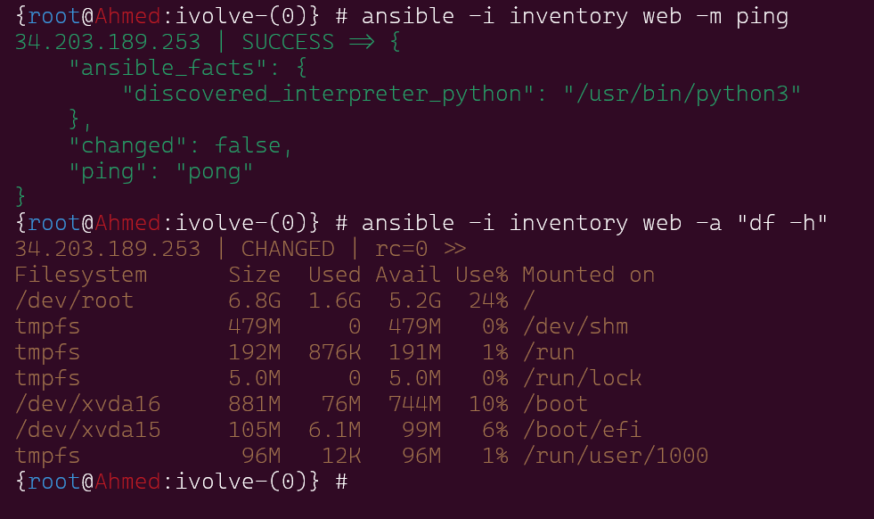

# lab4 Ansible ad-hoc

## Project Description

This project involves configuring and managing an AWS EC2 instance using SSH keys for secure access. The objective is to enable passwordless SSH access to the EC2 instance from your lab environment.

## Prerequisites

- An AWS EC2 instance running Ubuntu.
- SSH access to the EC2 instance using an existing private key.
- An SSH key pair generated on your lab machine.

## Steps to Add Your Public Key to the EC2 Instance

### 1. Generate an SSH Key Pair (if not already done)

If you don't already have an SSH key pair on your lab machine, generate one using the following command:

```bash
ssh-keygen -t rsa -b 2048
```

### 2. Copy Your Public Key to the EC2 Instance

```
 cat /root/.ssh/id_rsa.pub | ssh -i host1.pem ubuntu@ec2-34-203-189-253.compute-1.amazonaws.com 'cat >> ~/.ssh/authorized_keys'
```
### 3. create inventory and ansible.cfg to using defulats

show the inventory
```
[web]
34.203.189.253
```
show the ansible.cfg
```
[defaults]
remote_user = ubuntu

```
### 4. Verify Ansible ad-hoc command 
```
ansible -i inventory web -m ping
ansible -i inventory web -a "df -h"
```


