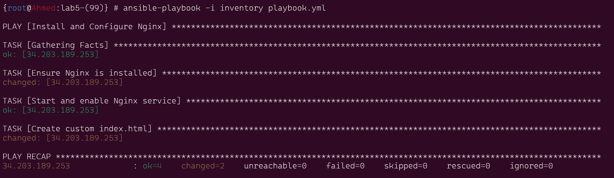
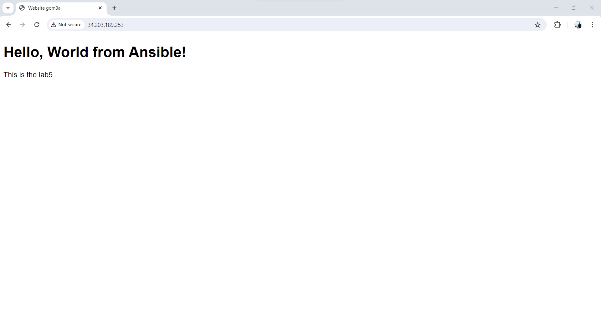

# lab5 Nginx Installation and Website Configuration using Ansible playbook


This repository contains an Ansible playbook for installing Nginx and configuring a custom landing page for a website.

## Requirements
Ansible installed on the control machine.
SSH access to the target server with sudo privileges.

### 1. create inventory and ansible.cfg to using defulats

show the inventory
```
[web]
34.203.189.253
```
show the ansible.cfg
```
[defaults]
remote_user = ubuntu

```


### 2. Run ansible playbook command
```bash
ansible-playbook -i inventory playbook

```




### 4. the final website of webserver


 