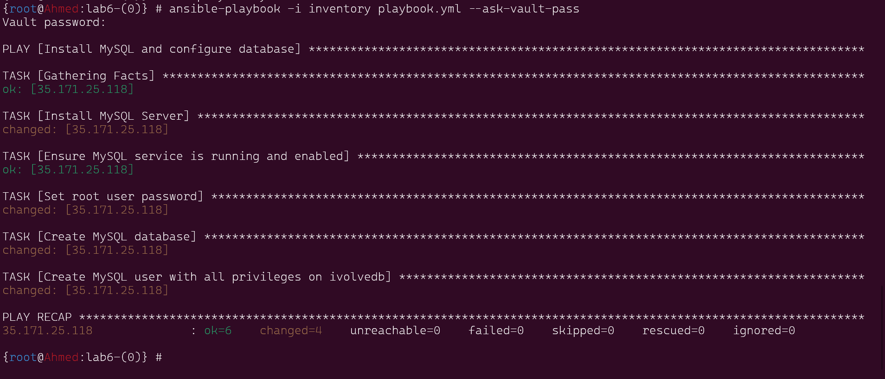
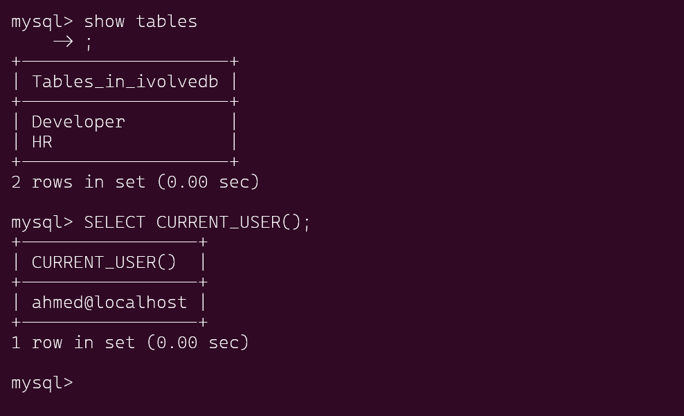

# lab6 sql Installation , creating Database and user to access using Ansible playbook


This repository contains an Ansible playbook designed to automate the installation of MySQL, creation of a database, setup of user access, and verification of database functionality using the created user.

## Prerequisites
1. Ansible: Ensure Ansible is installed on your control node.
2. SSH Access: Ensure SSH access to the target node(s) where MySQL will be installed.
3. Inventory File: Prepare an inventory file containing the IP addresses or hostnames of the target server(s).
4. Vault File: Create a vault file (vault.yml) to securely store sensitive information such as passwords.
***
## Installation Steps
1. Create Vault File: Generate a vault file (vault.yml) to store the MySQL root password and the password for the database user.

```bash
mysql_root_password: your_mysql_root_password
db_user_password: your_db_user_password

```
Encrypt the vault file using the ansible-vault command:

```bash
ansible-vault encrypt vault.yml

```
2. Modify Playbook Variables: Open the Ansible playbook (playbook.yml) and update the variables as needed:

mysql_root_password: Replace with the MySQL root password.
db_user_password: Replace with the password for the database user.

3. create inventory  for db and ansible.cfg to using defulats

show the inventory
```bash
[db]
35.171.25.118
```
show the ansible.cfg
```bash
[defaults]
remote_user = ubuntu
host_key_checking = False

```


4. Run the Playbook: Execute the Ansible playbook to install MySQL, create the database, create the user, and verify the database.
```bash
ansible-playbook -i inventory playbook.yml --ask-vault-pass

```




5. Verify Database Access: Post-execution, validate that the database is accessible using the created user:
```bash
mysql -u ahmed -p
USE ivolvedb;
SHOW TABLES FROM ivolvedb;

```

 