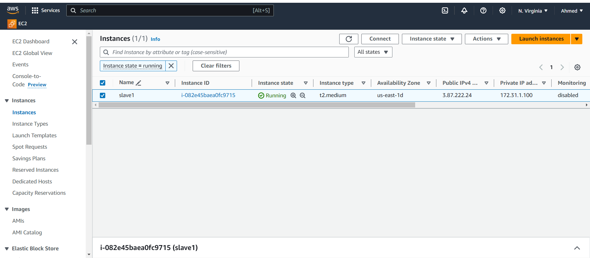
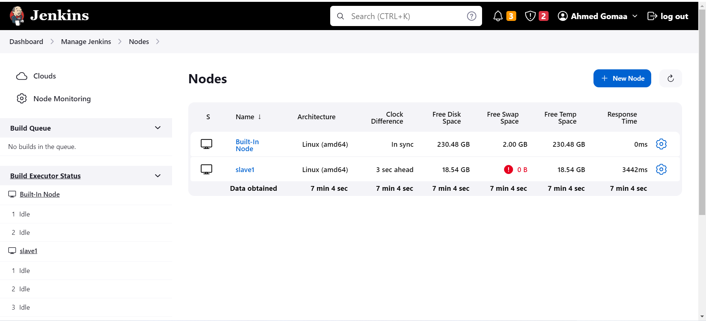
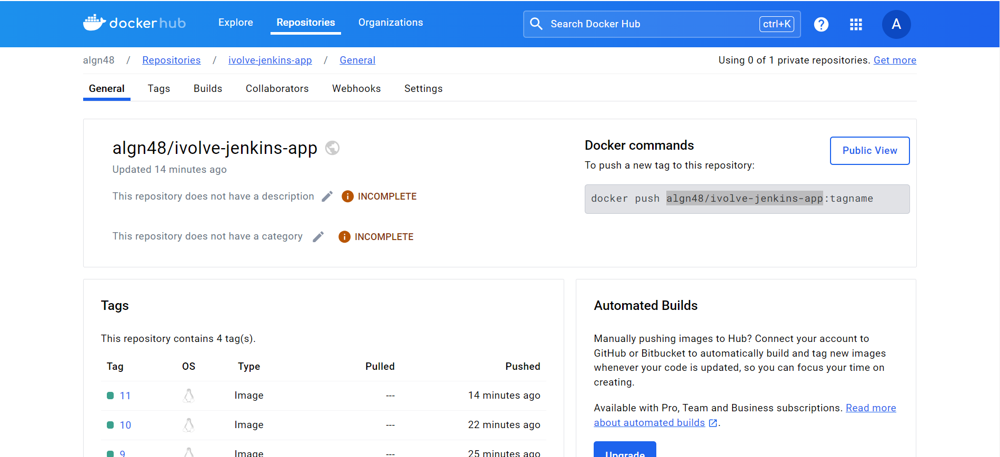
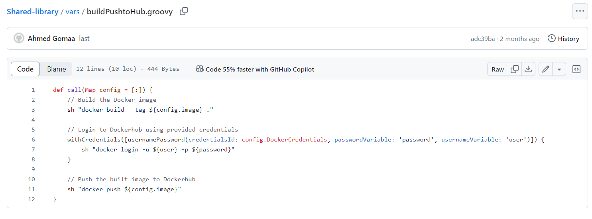
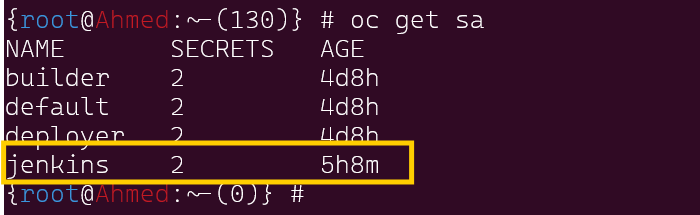
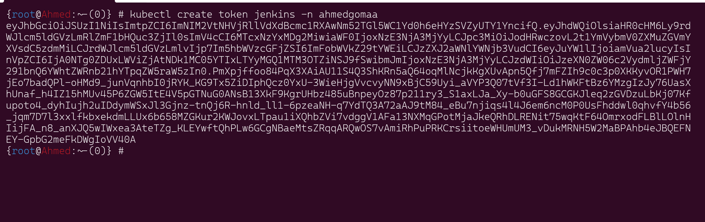
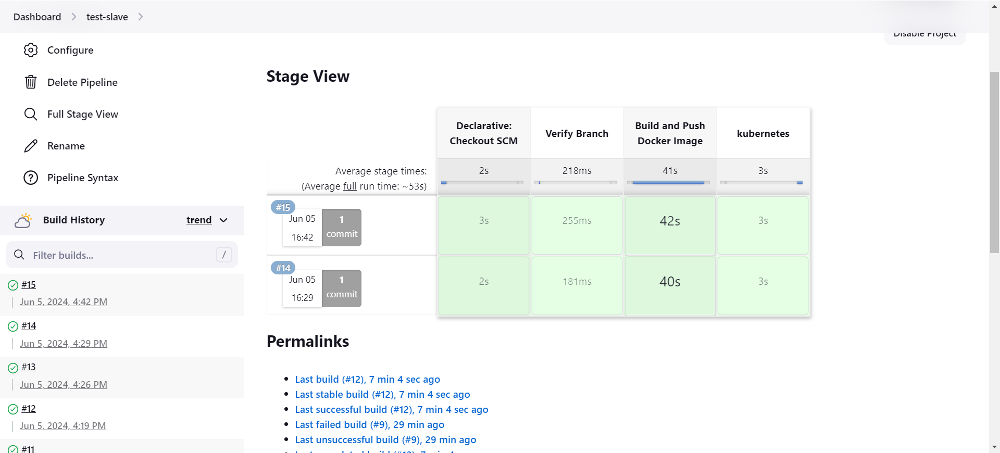
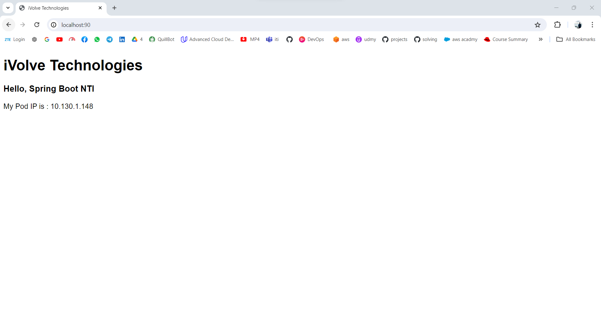

# Kubernetes Deployment using Master slave jenkins


## Overview


This project is a demonstration of a continuous integration and continuous deployment (CI/CD) pipeline using Jenkins. The pipeline is designed to build a Docker image of the application, push it to Docker Hub, and deploy it to an OpenShift cluster. The Jenkins pipeline leverages a master-slave architecture and utilizes a shared Jenkins library for modular and reusable pipeline code.


## Architecture

1. Jenkins Master: Orchestrates the pipeline.
2. Jenkins Slave: Executes the build and push tasks.
3. Docker Hub: Hosts the Docker images.
4. OpenShift: Deploys the application in the ahmedgomaa namespace (optinal).


## Prerequisites
Before you begin, ensure you have the following:

1. Jenkins Master and Slave setup
2. Docker installed on Jenkins Slave
3. Docker Hub account
4. OpenShift cluster with access to the ahmedgomaa namespace
5. Jenkins Shared Library
6. kubectl installed on Jenkins Slave

## Pipeline Workflow

1. Checkout Code: Jenkins Master checks out the code from the repository.
2. Build Docker Image: Jenkins Slave builds the Docker image.
3. Push Docker Image: The image is pushed to Docker Hub.
4. Deploy to OpenShift: The new image is deployed to the OpenShift cluster.

## Setup Instructions
### Jenkins Configuration

1. Set up Jenkins Master-Slave Configuration:
    - Configure Jenkins Master to communicate with Jenkins Slave. Ensure the Slave has Docker installed and properly configured.
    - Add the Slave node in Jenkins: Manage Jenkins > Manage Nodes > New Node.
    - creating slave in EC2 in aws

    
    - using ssh connection between master and slave 
    



2. Configure Jenkins Shared Library:
    - In Jenkins, navigate to Manage Jenkins > Configure System.
    - Scroll down to the Global Pipeline Libraries section.
    - Add a new library with the following details:
        - Name: shared-library
        - Default version: master (or the branch you want to use)
        - Retrieval method: Modern SCM
        - Source Code Management: Git
        - Project Repository: URL to your shared library repository.

3. Create a Jenkinsfile:

    1. Add a Jenkinsfile to your project repository with the following content:

```groovy
    @Library('shared-library') _

agent {label 'slave1'}
pipeline {
    environment {imageName = 'algn48/ivolve-jenkins-app'}
    agent any
    stages {
        stage('Verify Branch') {
            steps {echo "$GIT_BRANCH"}
        }
        
        stage('Build and Push Docker Image') {
            steps {
                script {  buildPushtoHub([ image: "${imageName}:${BUILD_NUMBER}", DockerCredentials: 'DOCKERHUB' ])  } 
            }
        }
                stage('kubernetes') {
            steps {
               withKubeCredentials(kubectlCredentials: [[caCertificate: '', clusterName: '', contextName: '', credentialsId: '4', namespace: '', serverUrl: '']]) {    
                 sh 'kubectl apply -f DeplymentAndSvc.yml -n ahmedgomaa'
                  }
            }  
        }   
     }
}

```
## the image after ppushing in DockerHub




### Jenkins Shared Library
Create the following Groovy scripts in your shared library:
my custem Shared Library you will find i there

```
https://github.com/gAhmedg/Shared-library
```

- buildAndPush.groovy:



### OpenShift Deployment Configuration
Create a DeplymentAndSvc.yml file for your OpenShift cluster with the following content:

```yaml

apiVersion: apps/v1
kind: Deployment
metadata:
  name: ivolve-jenkins-app-deployment
  labels:
    app: ivolve-jenkins-app
spec:
  replicas: 3
  selector:
    matchLabels:
      app: ivolve-jenkins-app
  template:
    metadata:
      labels:
        app: ivolve-jenkins-app
    spec:
      containers:
      - name: ivolve-jenkins-app
        image: algn48/ivolve-jenkins-app:10
        ports:
        - containerPort: 8081
---
apiVersion: v1
kind: Service
metadata:
  name: ivolve-jenkins-app-service
spec:
  type: LoadBalancer
  selector:
    app: ivolve-jenkins-app
  ports:
  - protocol: TCP
    port: 80
    targetPort: 8081
```

- Apply the deployment configuration to your OpenShift cluster:

```bash
oc apply -f deployment.yaml
```
- then create a service account for jenkins to can access cluster 

```bash
oc create sa jenkins -n ahmedgomaa
```


Create a RoleAndRolebinding.yml file for your OpenShift cluster with the following content:

```yaml

apiVersion: v1
kind: ServiceAccount
metadata:
  name: jenkins
  namespace: ahmedgomaa

---
apiVersion: rbac.authorization.k8s.io/v1
kind: Role
metadata:
  name: jenkins-role
  namespace: ahmedgomaa
rules:
- apiGroups: [""]
  resources: ["pods", "services", "deployments"]
  verbs: ["get", "list", "watch", "create", "update", "delete"]

---
apiVersion: rbac.authorization.k8s.io/v1
kind: RoleBinding
metadata:
  name: jenkins-rolebinding
  namespace: ahmedgomaa
subjects:
- kind: ServiceAccount
  name: jenkins
  namespace: ahmedgomaa
roleRef:
  kind: Role
  name: jenkins-role
  apiGroup: rbac.authorization.k8s.io

```
then apply 

```sh
oc apply -f RoleAndRolebinding.yml
```
finally to get tooken for 

```sh
kubectl create token jenkins -n ahmedgomaa
```


## THE PIPELINE FINAL STAGES



## THE FINAL WEBSITE AFTER DEPLOYED IN CLUSTER 




## Troubleshooting
### Common Issues

- Jenkins Slave Not Connecting:
    - Ensure the Slave node has the correct IP and port configurations.
    - Verify that the Slave has Docker installed and properly configured.

- Docker Build Fails:
    - Check the Dockerfile for syntax errors.
    - Ensure all dependencies are available and paths are correct.

- Push to Docker Hub Fails:
    - Verify Docker Hub credentials in Jenkins.
    - Ensure the Docker Hub repository exists and you have push access.
## Logs and Diagnostics

- Check Jenkins build logs for detailed error messages.
- Use docker logs on the Jenkins Slave to debug Docker issues.
- Use oc logs on OpenShift to diagnose deployment problems.


