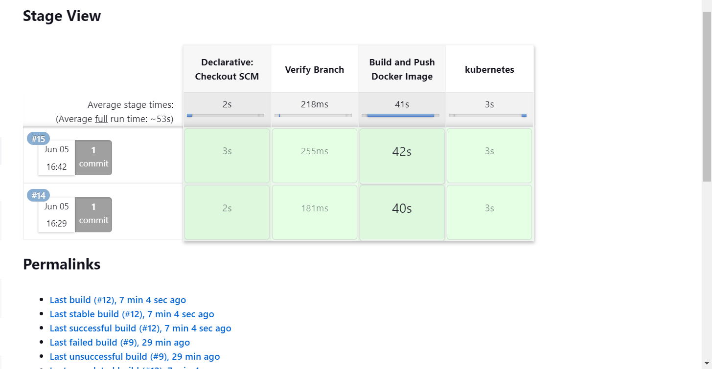

# K8s-Jenkins-Deployment

## Overview
The "K8s-Jenkins-Deployment" project facilitates the deployment of applications using Kubernetes (K8s) and Jenkins pipelines. This project streamlines the setup process, automating the deployment steps from building Docker images to deploying applications on Kubernetes clusters.


## Table of Contents
- [Prerequisites](#prerequisites)
- [Getting Started](#getting-started)
- [Pipeline Steps](#pipeline-steps)
- [Jenkinsfile Example](#jenkinsfile-example)
- [Jenkins Shared Libraries](#jenkins-shared-libraries)
- [Pipeline Post Actions](#pipeline-post-actions)
- [References](#references)

## Prerequisites
Before using this project, ensure that you have the following prerequisites:

- Docker: For building and managing containerized applications.
- Kubernetes/OpenShift: For orchestrating containerized applications.
- Jenkins: For implementing continuous integration and continuous deployment (CI/CD) pipelines.
- Docker Hub Account: For storing Docker images.
- Git: For version control and cloning the project repository.

## Getting Started
To deploy applications using this project, follow these steps:

1. Clone the "K8s-Jenkins-Deployment" project repository to your local machine:

`bash
git clone https://github.com/gAhmedg/jenkins-project.git
cd jenkins-project
`

2. Set up your K8s environment, preferably using OpenShift, and create a service account for the deployment process.

3. Configure Jenkins to integrate with your project repository and set up the required credentials (e.g., Docker Hub credentials).

4. Set up the Jenkins pipeline using the provided Jenkinsfile or customize it according to your requirements.

5. Configure the pipeline to trigger on changes to the repository and define the pipeline steps as outlined below.

## Pipeline Steps
The pipeline includes the following steps:
1. Verify the branch from which the code is being built.
2. Build and push the Docker image to Docker Hub.
3. Update the Kubernetes deployment with the new Docker image.
4. Deploy the updated image to the Kubernetes cluster.

## Jenkinsfile Example
Here's an example Jenkinsfile that defines the pipeline stages:

```groovy
@Library('shared-library') _

pipeline {
    environment { 
        imageName = 'algn48/nti-app-python'
        yamlfiles = 'kuberenetes/DeploymentAndServices.yml'
    }

    agent any

    stages {
        stage('Verify Branch') {
            steps {
                echo "$GIT_BRANCH"
            }
        }
   
        stage('Build and Push Docker Image') {
            steps {
                script {
                    buildPushtoHub([image: "${imageName}:${BUILD_NUMBER}", DockerCredentials: 'DOCKERHUB'])
                }
            }
        }
    
        stage('Deploy in Kubernetes') {
            steps {
                withKubeCredentials(kubectlCredentials: [[caCertificate: '', clusterName: '', contextName: '', credentialsId: '4', namespace: 'ahmedgomaa', serverUrl: 'https://api.ocp-training.ivolve-test.com:6443']]) {    
                    sh "sed 's|image:.*|image: ${imageName}:${BUILD_NUMBER}|' ${yamlfiles} > python-app.yml"
                    sh 'oc apply -f python-app.yml -n ahmedgomaa'
                }
            }
        }
    }

    post {
        success {
            script {
                echo 'Docker image build, push, and deploy succeeded'
            }
        }
        failure {
            script {
                echo 'Docker image build, push, and deploy failed'
            }
        }
    }
}
```

## Jenkins Shared Libraries
To manage reusable pipeline code, you can use Jenkins shared libraries. Create the following Groovy scripts in your shared library repository:

### Shared Library Repository
You can find a custom shared library at the following URL:
[Shared Library](https://github.com/gAhmedg/Shared-library)

### Example Groovy Script: `buildAndPush.groovy`
Add this script to handle Docker image build and push operations.


### Final Stages for Pipeline
The final stages of the pipeline can be visualized as shown below:



## References
- [Jenkins Documentation](https://www.jenkins.io/doc/)
- [Kubernetes Documentation](https://kubernetes.io/docs/)
- [Docker Documentation](https://docs.docker.com/)
- [GitHub Guides](https://guides.github.com/)
