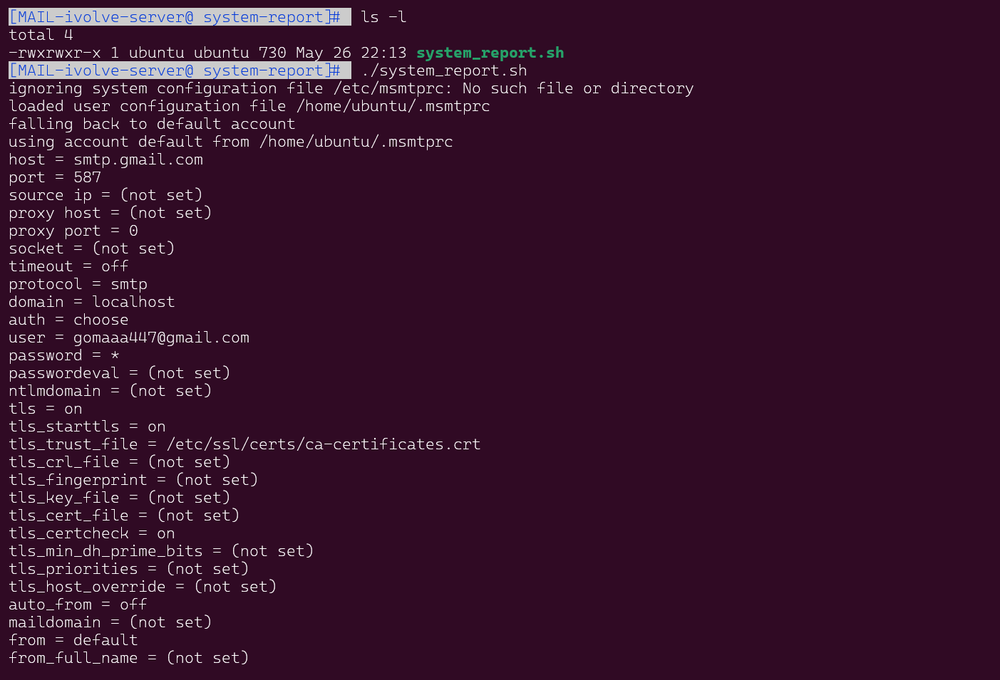

# Labs

## Lab2 System Report Script

This script collects system storage, CPU, and memory usage information and sends it via email to a specified Gmail address using `msmtp`.


## Prerequisites

1. **msmtp**: Ensure `msmtp` is installed and configured correctly.
2. **mailutils**: Install `mailutils` for `mailx` command if not already installed.

### Installation

1. **Install msmtp and mailutils**:
```bash
    sudo apt update
    sudo apt install msmtp mailutils
```

2. **Configure msmtp**:
    Create a `~/.msmtprc` file with the following content:


3. **Set Permissions**:
    Ensure the `~/.msmtprc` file has the correct permissions:

```bash
    chmod 600 ~/.msmtprc
```
4. **Make the Script Executable and Run it**:
    ```bash
   chmod +x system_report.sh
   ./system_report.sh
    ```


 

 5. **the output**:

  

***

***


## Lab3 Ping Script

This is a simple Bash script named `lab3-ping.sh` to ping all devices in a given subnet (`192.168.1.0/24`). 
The script pings each IP address in the subnet and reports whether the host is up or down.

### Usage

1. Clone the repository or download the `lab3-ping.sh` script to your local machine.
2. Make the script executable:
   ```sh
   chmod +x lab3-ping.sh
   ```

3. Run the script 
    ```sh
   ./lab3-ping.sh
   ```

### Example Output

 ```sh
    Host 192.168.1.1 is up
    Host 192.168.1.2 is up
    Host 192.168.1.3 is up
    Host 192.168.1.4 is down
  ```

 
