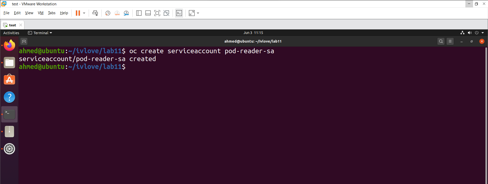
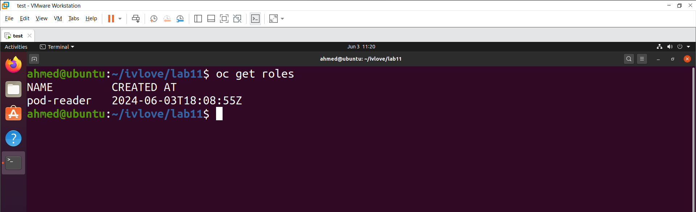
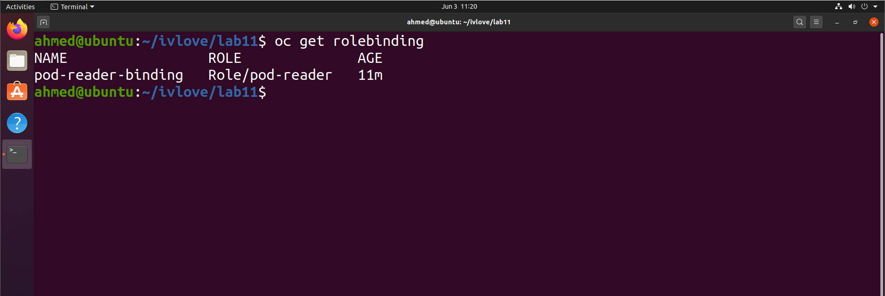

# Lab 11: OpenShift Security and RBAC

## Objective
In this lab, we will:
- Create a `ServiceAccount`.
- Define a `Role` named `pod-reader` that allows read-only access to pods in a specific namespace.
- Bind the `pod-reader` Role to the `ServiceAccount`.
- Retrieve the `ServiceAccount` token.
- Compare `Role` & `RoleBinding` with `ClusterRole` & `ClusterRoleBinding`.

## Prerequisites
- OpenShift CLI (`oc`) installed and configured.
- Access to an OpenShift cluster.
- Sufficient permissions to create roles, role bindings, and service accounts.

## Steps

### 1. Create a ServiceAccount

- Create a `ServiceAccount` named `pod-reader-sa`:
```bash
oc create serviceaccount pod-reader-sa
```


### 2. Define a Role
- Define a `Role` named `pod-reader` that allows read-only access to pods in aCreate a YAML file named pod-reader-role.yaml with the following content:
```yaml
apiVersion: rbac.authorization.k8s.io/v1
kind: Role
metadata:
  name: pod-reader
rules:
- apiGroups: [""]
  resources: ["pods"]
  verbs: ["get", "list", "watch"]
```
- Apply the role:
```bash
oc apply -f pod-reader-role.yaml
```
- Verify the creation:

```bash
oc get roles
```


### 3. Bind the Role to the ServiceAccount
- Create a YAML file named pod-reader-rolebinding.yaml with the following content:

```yaml
apiVersion: rbac.authorization.k8s.io/v1
kind: RoleBinding
metadata:
  name: pod-reader-binding
subjects:
- kind: ServiceAccount
  name: pod-reader-sa
  namespace: your-namespace
roleRef:
  kind: Role
  name: pod-reader
  apiGroup: rbac.authorization.k8s.io
Apply the role binding:
```
```bash
oc apply -f pod-reader-rolebinding.yaml
```
- Verify the creation:

```bash
oc get rolebindings
```


### 4. Get the ServiceAccount Token
- 1- Create a secret for the ServiceAccount:
Create a YAML file named pod-reader-token-secret.yaml with the following content:


```yml
apiVersion: v1
kind: Secret
metadata:
  name: pod-reader-token
  annotations:
    kubernetes.io/service-account.name: pod-reader-sa
type: kubernetes.io/service-account-token
```
- Apply the secret:

```bash
oc apply -f pod-reader-token-secret.yaml
```
- 2- Retrieve and Decode the Token:

```bash
# Get the name of the secret created for the ServiceAccount
SECRET_NAME=$(oc get secret | grep pod-reader-token | awk '{print $1}')

# Retrieve the token securely
TOKEN=$(oc get secret $SECRET_NAME -o jsonpath='{.data.token}' | base64 --decode)

# Display the token
echo "The token for the ServiceAccount pod-reader-sa is: $TOKEN"

```
### 5. Comparison: Role vs. RoleBinding and ClusterRole vs.ClusterRoleBinding

 

### Comparison: Role & RoleBinding

| Aspect    | Role                                                                  | RoleBinding                                                        |
|-----------|-----------------------------------------------------------------------|--------------------------------------------------------------------|
| **Scope** | Namespace-scoped                                                     | Namespace-scoped                                                   |
| **Definition** | Defines permissions within a specific namespace.                  | Binds the Role to a user, group, or `ServiceAccount` within the same namespace. |
| **Usage**  | Use for permissions that are limited to a specific namespace.         | Use to grant the defined permissions to a user, group, or `ServiceAccount` within the namespace. |


### Comparison: ClusterRole & ClusterRoleBinding

| Aspect       | ClusterRole                                                            | ClusterRoleBinding                                                   |
|--------------|------------------------------------------------------------------------|----------------------------------------------------------------------|
| **Scope**    | Cluster-scoped                                                         | Cluster-scoped                                                       |
| **Definition**| Defines permissions at the cluster level and can be used in any namespace. | Binds the ClusterRole to a user, group, or `ServiceAccount` at the cluster level, across all namespaces. |
| **Usage**    | Use for permissions that need to be available cluster-wide or across multiple namespaces. | Use to grant the defined cluster-wide permissions to a user, group, or `ServiceAccount` across all namespaces. |

## Summary
In this lab, we successfully created a ServiceAccount, defined a Role with read-only access to pods, bound the Role to the ServiceAccount, retrieved the ServiceAccount token securely, and compared Role & RoleBinding with ClusterRole & ClusterRoleBinding. This setup is fundamental for managing access controls effectively in OpenShift.