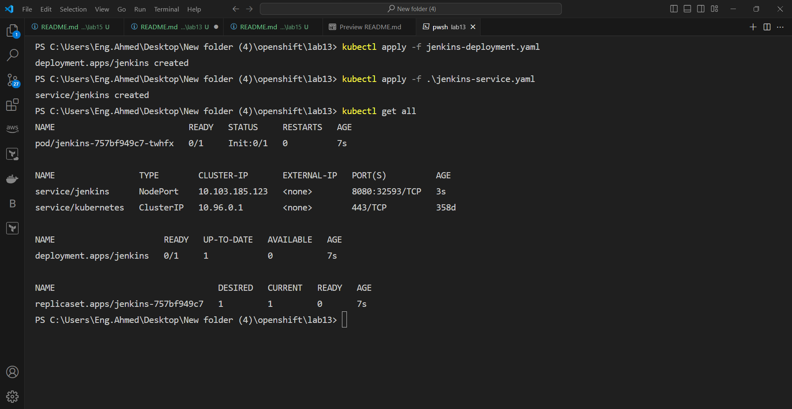
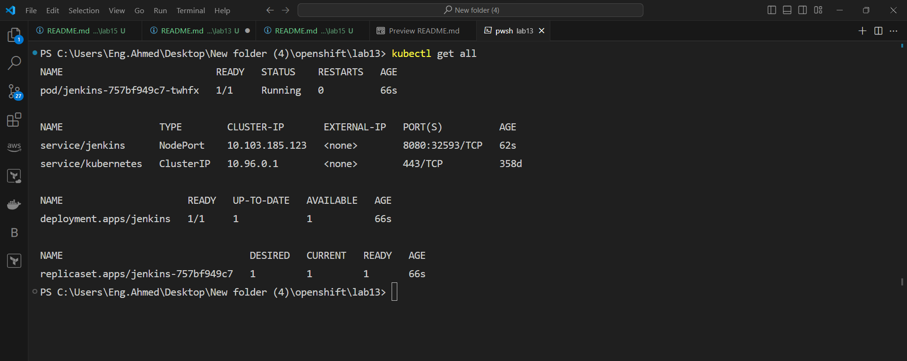
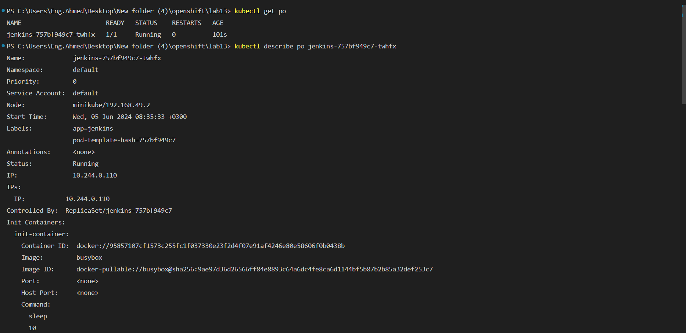
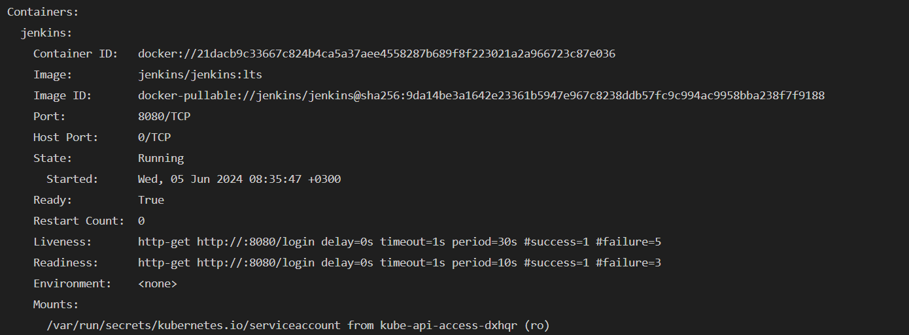

# Lab 13: Multi-container Applications
## Objective
The objective of this lab is to create a deployment for Jenkins with an init container that sleeps for 10 seconds before the Jenkins container starts. We will also use readiness and liveness probes to monitor Jenkins, create a NodePort service to expose Jenkins, and verify that the init container runs successfully and Jenkins is properly initialized.


Lab Steps
Step 1: Create the Jenkins Deployment
Define the Jenkins Deployment YAML
Create a YAML file named jenkins-deployment.yaml with the following content:

```yaml
apiVersion: apps/v1
kind: Deployment
metadata:
  name: jenkins-deployment
spec:
  replicas: 1
  selector:
    matchLabels:
      app: jenkins
  template:
    metadata:
      labels:
        app: jenkins
    spec:
      initContainers:
      - name: init-sleep
        image: busybox
        command: ["sleep", "10"]
      containers:
      - name: jenkins
        image: jenkins/jenkins:lts
        ports:
        - containerPort: 8080
        readinessProbe:
          httpGet:
            path: /login
            port: 8080
          initialDelaySeconds: 30
          periodSeconds: 10
        livenessProbe:
          httpGet:
            path: /login
            port: 8080
          initialDelaySeconds: 60
          periodSeconds: 10
```
Deploy Jenkins
Apply the deployment using kubectl:

```bash
kubectl apply -f jenkins-deployment.yaml
```
## Step 2: Create the NodePort Service
### Define the NodePort Service YAML
- Create a YAML file named jenkins-service.yaml with the following content:

```yaml
apiVersion: v1
kind: Service
metadata:
  name: jenkins-service
spec:
  type: NodePort
  selector:
    app: jenkins
  ports:
    - port: 8080
      targetPort: 8080
      nodePort: 30000
```
### Expose Jenkins
- Apply the service using kubectl:

```bash
kubectl apply -f jenkins-service.yaml
```



## Step 3: Verify the Init Container and Jenkins Initialization

## Check the pod status:
Run the following command to get the status of the pod:
```sh
kubectl get pods
```


## Verify the initContainer and Jenkins logs:
Run the following command to view the logs of the initContainer:
```sh
kubectl describe po <pod-name>
```


## Ensure that the Jenkins logs show that the application started up correctly, with no errors.

Run the following command to view the probe statuses:

```sh
kubectl describe pod <pod-name>
```



## Readiness vs. Liveness Probes in Kubernetes

| Feature | Readiness Probe | Liveness Probe |
|---|---|---|
| Purpose | Determines if a container is ready for traffic | Determines if a container is healthy and running |
| Behavior | Excludes unready Pods from service discovery | Restarts containers that fail the probe repeatedly |
| Use Cases | Controlled deployments, rollbacks | Self-healing, automated container restarts |
| Common Implementations | HTTP Get, TCP Socket, Exec | HTTP Get, TCP Socket, Exec |

-----------------

## Init Container vs. Sidecar Container in Kubernetes

| Feature | Init Container | Sidecar Container |
|---|---|---|
| Purpose | Performs one-time setup tasks before the main container starts | Runs alongside the main container and provides additional functionalities |
| Execution | Runs and completes sequentially before the main container starts | Runs concurrently with the main container throughout its lifecycle |
| Restart Policy | Not applicable (doesn't have a restart policy) | Inherits the restart policy of the main container |
| Resource Sharing | Can share volumes with the main container (optional) | Can share volumes and network namespace with the main container |
| Use Cases | - Downloading dependencies - Initializing databases - Configuring environment variables | - Monitoring the main container - Providing sidecar functionality (e.g., logging, caching) - Proxy for accessing services |
| Examples | - Busybox container to download configuration files | - Prometheus exporter container for scraping metrics |
