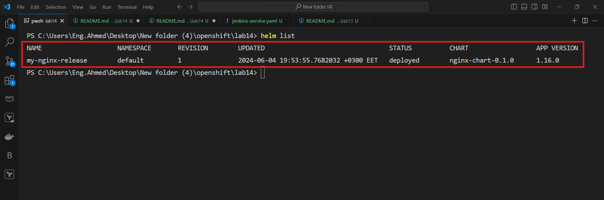

# Lab 14: Helm Chart Deployment
## Prerequisites:
- OpenShift CLI (oc) installed and configured or kubectl.
- Helm CLI installed.
- Access to your cluster.

## Step 1: Explore Helm Charts for Common Services

Before creating a Helm chart for Nginx, you can explore and install some common Helm charts to get familiar with Helm's capabilities.
```sh 
helm repo add stable https://charts.helm.sh/stable
helm repo update
helm search repo stable
```

## Step 2: Create a New Helm Chart for Nginx
1. Create a Helm Chart:
Run the following command to create a new Helm chart for Nginx:

```sh
helm create nginx-chart
cd nginx-chart
```

2. Modify the Chart:
Edit the values.yaml file to customize your Nginx deployment. You can set the image, service type, and other configurations.
```yaml
# values.yaml
replicaCount: 1

image:
  repository: nginx
  pullPolicy: IfNotPresent
  tag: "latest"

service:
  type: ClusterIP
  port: 80

ingress:
  enabled: false

resources: {}
```
3. Update Deployment Template:
If necessary, you can update the deployment template in templates/deployment.yaml to match your specific requirements.


## Step 3: Deploy the Helm Chart
1. Initialize Helm in Your Namespace optional:
Ensure Helm is initialized in your OpenShift namespace (project):

```sh
oc new-project my-nginx-project
```
2. Deploy the Chart:
Use Helm to deploy the Nginx chart:

```sh
helm install my-nginx-release ./nginx-chart
```


3. Verify the Deployment:
Check the status of your release and the resources created:

```sh
helm list
oc get all -n my-nginx-project
```


Verify that the Nginx server is running:

```sh
oc get svc -n my-nginx-project
```
To access the Nginx server, you might need to prot-forward to can access it :

```sh
kubectl  port-forward service/my-nginx-release-nginx-chart 82:80
```


## Step 4: upgrade Release
we can upgrade or application or release
by using command belw after edit and add the changes in charts
i will change the image for deployment from nginx to algn10


```sh
helm upgrade my-nginx-release ./nginx-chart
helm list 
```


 the new webiste appear in the same localhost:82 after port forwarding 


## Step 5: Delete Nginx Release
- Delete the Release:
When you are done, you can delete the Helm release:

```sh
helm uninstall my-nginx-release
```
- Verify Deletion:
Confirm that all resources have been removed:

```sh
oc get all -n my-nginx-project
```
## Conclusion
By following these steps, you should be able to create, deploy, and manage an Nginx application using Helm in an OpenShift cluster. This lab provides hands-on experience with Helm, making it easier to manage complex applications in a Kubernetes environment.


