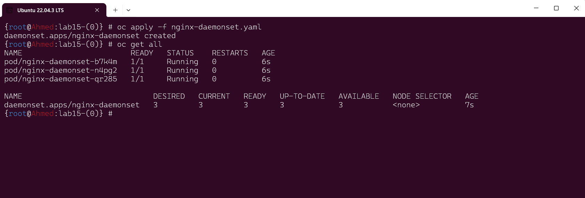

# Lab 15: Daemonsets & Taint and Toleration
## Objective
In this lab, we explore the concepts of DaemonSets, Taints, and Tolerations in Kubernetes. We aim to understand what DaemonSets are and their use cases. Specifically, we will create a DaemonSet YAML file with a Pod template containing an Nginx container in OpenShift and verify the number of pods created. Additionally, using Minikube, we will taint the Minikube node with a specific key-value pair ('color=red') to simulate a tainted node. Then, we'll create a pod with toleration 'color=blue' and observe the status of the pod. Finally, we'll change the toleration to 'color=red' and observe the consequences. Throughout the lab, we will make a comparison between Taint & Toleration and Node Affinity.


## Steps
- Understanding DaemonSets:
  - Explanation of what DaemonSets are and their purpose.

- Creating DaemonSet YAML:
  - Generate a DaemonSet YAML file with a Pod template containing an Nginx container in OpenShift.

- Verification of Pods:
  - Confirm the number of pods created by the DaemonSet.

- Tainting the Minikube Node:
  -Simulate a tainted node by tainting the Minikube node with a specific key-value pair ('color=red').

- Creating Pods with Tolerations:
  - Create a pod with toleration 'color=blue' and observe the status of the pod.
  - Change the toleration to 'color=red' and observe the consequences.

- Comparison with Node Affinity:
  - Compare and contrast Taint & Toleration with Node Affinity.


### What is a DaemonSet?
A DaemonSet is a Kubernetes controller that ensures a specified pod runs on all (or a subset of) nodes in a cluster. It's typically used for tasks that need to be performed on each node, such as logging, monitoring, or other system services.

### Use Cases for DaemonSets
- Running a cluster storage daemon on every node (e.g., glusterd, ceph).
- Running a logs collection daemon on every node (e.g., fluentd, logstash).
- Running a node monitoring daemon on every node (e.g., Prometheus Node Exporter, collectd).
- Creating a DaemonSet in OpenShift
## LAB Steps
### Part 1: Daemonsets
1. YAML file to create a DaemonSet with an Nginx container:

```yaml
apiVersion: apps/v1
kind: DaemonSet
metadata:
  name: nginx-daemonset
  namespace: default
spec:
  selector:
    matchLabels:
      app: nginx
  template:
    metadata:
      labels:
        app: nginx
    spec:
      containers:
      - name: nginx
        image: nginx:latest
        ports:
        - containerPort: 80
```

To create this DaemonSet, save the file as nginx-daemonset.yaml and apply it using:

```sh
oc apply -f nginx-daemonset.yaml
```
2. Verify the number of pods created by the DaemonSet:

```sh
oc get pods -l app=nginx
```

we have 3 nodes so we get 3 DaemonSets

### Part 2: Taint and Toleration
Tainting a Minikube Node
To taint a Minikube node with a specific key-value pair color=red:

```sh
kubectl taint nodes minikube color=red:NoSchedule
```
Creating Pods with Toleration
Pod with toleration color=blue:

Save the following YAML as pod-toleration-blue.yaml:

```yaml
apiVersion: v1
kind: Pod
metadata:
  name: pod-toleration-blue
spec:
  containers:
  - name: nginx
    image: nginx:latest
  tolerations:
  - key: "color"
    operator: "Equal"
    value: "blue"
    effect: "NoSchedule"
```
Apply the pod:

```sh
kubectl apply -f pod-toleration-blue.yaml
```
Observe the status of the pod:

```sh
kubectl get pods pod-toleration-blue
```

Pod with toleration color=red:
Save the following YAML as pod-toleration-red.yaml:

```yaml
apiVersion: v1
kind: Pod
metadata:
  name: pod-toleration-red
spec:
  containers:
  - name: nginx
    image: nginx:latest
  tolerations:
  - key: "color"
    operator: "Equal"
    value: "red"
    effect: "NoSchedule"
```
Apply the pod:

```sh
kubectl apply -f pod-toleration-red.yaml
```
Observe the status of the pod:

```sh
kubectl get pods pod-toleration-red
```
## Comparison: Taint & Toleration vs Node Affinity
### Taint & Toleration
```Taint: Applied to nodes, it repels a set of pods from being scheduled on the nodes unless those pods have matching tolerations.
Toleration: Applied to pods, it allows the pods to tolerate nodes with matching taints.
```
### Node Affinity
  Node Affinity: Allows pods to specify rules about the nodes on which they can be scheduled. It is more like "soft" scheduling constraints compared to the "hard" constraints of taints and tolerations.
  RequiredDuringSchedulingIgnoredDuringExecution: Pods are only scheduled on nodes that match the specified labels.
  PreferredDuringSchedulingIgnoredDuringExecution: Pods prefer to be scheduled on nodes that match the specified labels, but it's not mandatory.
### Feature	Taint & Toleration	Node Affinity
  Purpose	Repel or attract pods based on node conditions	Prefer or require nodes for pod scheduling
  Application	Applied to nodes (taints) and pods (tolerations)	Applied to pods
  Constraints	Hard constraints	Soft and hard constraints
  Use Case	Prevent specific pods from being scheduled on nodes	Prefer or require certain nodes for pods
  By understanding these concepts and differences, you can better manage pod scheduling and node resources in your Kubernetes clusters.