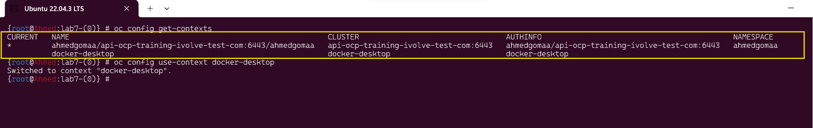
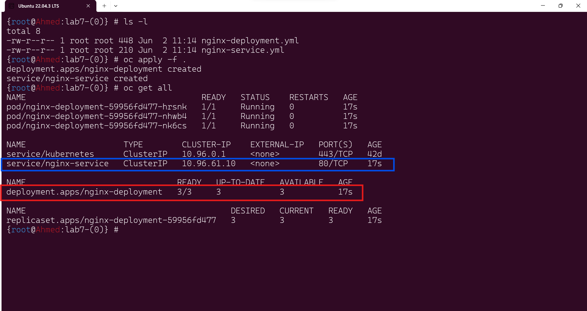
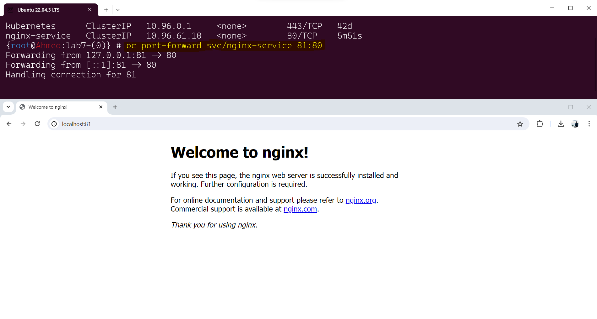

# Lab7: Deployment and Management of NGINX with Kubernetes
## Objectives
- Deploy NGINX with 3 replicas.
- Create a service to expose the NGINX deployment.
- Use port forwarding to access the NGINX service locally.
- Update the NGINX image to Apache.
- View the deployment's rollout history.
- Roll back the NGINX deployment to the previous image version.
- Monitor pod status to confirm a successful rollback.

## Prerequisites
- Kubernetes cluster set up and running.
- oc or kubectl command-line tool configured to interact with the cluster.
- Basic knowledge of Kubernetes concepts such as Pods, Deployments, and Services.


## Steps
**frsit make sure to choose the correct cluster will deploy on it**

***
```bash
oc config get-contexts
oc config use-context <name-of-cluster>
```
### 1. Deploy NGINX with 3 replicas service to expose the NGINX deployment
Create a deployment file nginx-deployment.yaml:
```yml
apiVersion: apps/v1
kind: Deployment
metadata:
  name: nginx-deployment
  labels:
    app: nginx
    owner: ahmed
    company: ivolve
spec:
  replicas: 3
  selector:
    matchLabels:
      app: nginx
  template:
    metadata:
      labels:
        app: nginx
        owner: ahmed
        company: ivolve
    spec:
      containers:
      - name: nginx
        image: nginx:latest
        ports:
        - containerPort: 80
```
Apply the deployment:


```bash
oc apply -f nginx-deployment.yaml
```


Create a service file nginx-service.yaml:

```yml
apiVersion: v1
kind: Service
metadata:
  name: nginx-service
  labels:
    app: nginx
spec:
  selector:
    app: nginx
  ports:
  - protocol: TCP
    port: 80
    targetPort: 80
  type: ClusterIP

```
Apply the service:

```bash
oc apply -f nginx-service.yaml
```

***
### 2. Use port forwarding to access the NGINX service locally


Use oc port-forward to access the service locally:
```bash
oc port-forward svc/nginx-service 81:80

```
Now, you can access the NGINX service at http://localhost:81.



### 3. Update the NGINX image to your image
Update the deployment to use your image using :
```bash
oc set image deployment/nginx-deployment nginx=algn48/ivolve-website:latest
```


### 4. View the deployment's rollout history
To view the rollout history:

```bash
oc rollout history deployment/nginx-deployment
```

### 5. Roll back the NGINX deployment to the previous image version
To roll back the deployment:

```bash
oc rollout undo deployment/nginx-deployment
```
the GIF show the steps (4,5and 6)  

## Conclusion
By following these steps, you have successfully deployed NGINX with 3 replicas, exposed it via a service, updated the deployment to use another image, viewed the rollout history, rolled back to the previous version, and confirmed the rollback by monitoring the pod status.


