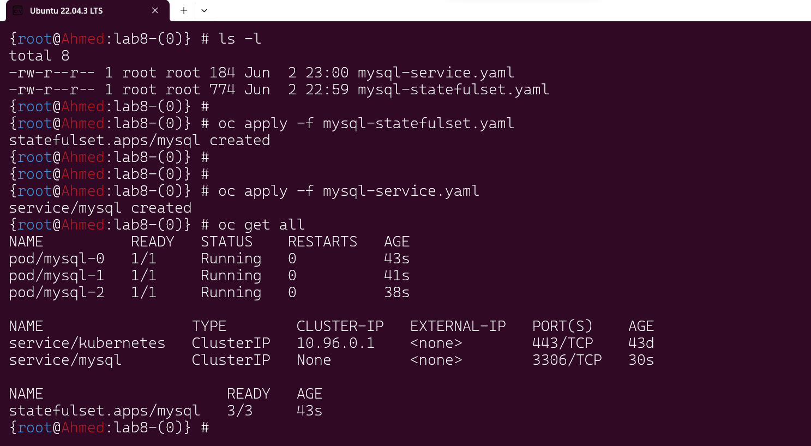
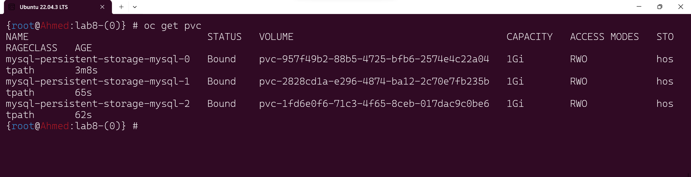

# Lab 8: Deployment vs. StatefulSet
## Overview
This lab focuses on understanding the differences between Deployments and StatefulSets in Kubernetes. You will learn when to use each type of resource and how to create a StatefulSet for MySQL with an accompanying Service configuration.

## Table of Contents
- Objective
- Prerequisites
- Comparing Deployment and StatefulSet
- YAML Configuration Files
    - MySQL StatefulSet
    - MySQL Service
- Usage
- Conclusion
- References

## Objective
By the end of this lab, you will:

- Understand the differences between Deployment and StatefulSet in Kubernetes.
- Create a YAML configuration file for a MySQL StatefulSet.
- Write a YAML configuration file to define a service for the MySQL StatefulSet.
## Prerequisites
- Basic understanding of Kubernetes concepts (Pods, Services, etc.).
- A running Kubernetes cluster.
- kubectl or (oc cli) installed and configured to interact with your cluster.

## Comparing Deployment and StatefulSet
### Deployment
- Use Case: Stateless applications.
- Pod Identity: Pods are interchangeable and do not have a persistent identity.
- Scaling: Easy to scale up and down.
- Updates: Rolling updates are supported out-of-the-box.
- Storage: Ephemeral storage.
### StatefulSet
- Use Case: Stateful applications.
- Pod Identity: Each Pod has a unique, persistent identity.
- Scaling: Pods are created and deleted in a defined order.
- Updates: Supports ordered, graceful rolling updates.
- Storage: Persistent storage with stable network identity.
## YAML Configuration Files
### MySQL StatefulSet
Create a file named mysql-statefulset.yaml with the following content:

```yaml
apiVersion: apps/v1
kind: StatefulSet
metadata:
  name: mysql
  labels:
    app: mysql
spec:
  serviceName: "mysql"
  replicas: 3
  selector:
    matchLabels:
      app: mysql
  template:
    metadata:
      labels:
        app: mysql
    spec:
      containers:
      - name: mysql
        image: mysql:5.7
        ports:
        - containerPort: 3306
          name: mysql
        env:
        - name: MYSQL_ROOT_PASSWORD
          value: rootpassword
        volumeMounts:
        - name: mysql-persistent-storage
          mountPath: /var/lib/mysql
  volumeClaimTemplates:
  - metadata:
      name: mysql-persistent-storage
    spec:
      accessModes: [ "ReadWriteOnce" ]
      resources:
        requests:
          storage: 1Gi
```
### MySQL Service
Create a file named mysql-service.yaml with the following content:

```yaml
apiVersion: v1
kind: Service
metadata:
  name: mysql
  labels:
    app: mysql
spec:
  ports:
  - port: 3306
    name: mysql
  clusterIP: None
  selector:
    app: mysql

```

## Usage
1- Apply the MySQL Service configuration:

```sh
kubectl apply -f mysql-service.yaml
```

2-Apply the MySQL StatefulSet configuration:
```sh
kubectl apply -f mysql-statefulset.yaml
```
3- Verify the StatefulSet and Service:

```sh
kubectl get all 
```

***
4- Verify the PVC for each pod:
```sh
kubectl get pvc 
```

## Conclusion
In this lab, you learned the differences between Deployments and StatefulSets, created a MySQL StatefulSet, and defined a service for it. StatefulSets are essential for stateful applications that require persistent storage and stable network identities.

## References
- [Kubernetes Documentation - StatefulSet](https://kubernetes.io/docs/concepts/workloads/controllers/statefulset/)
- [Kubernetes Documentation - Deployment](https://kubernetes.io/docs/concepts/workloads/controllers/deployment/)
- [Kubernetes Documentation - Services](https://kubernetes.io/docs/concepts/services-networking/service/)
