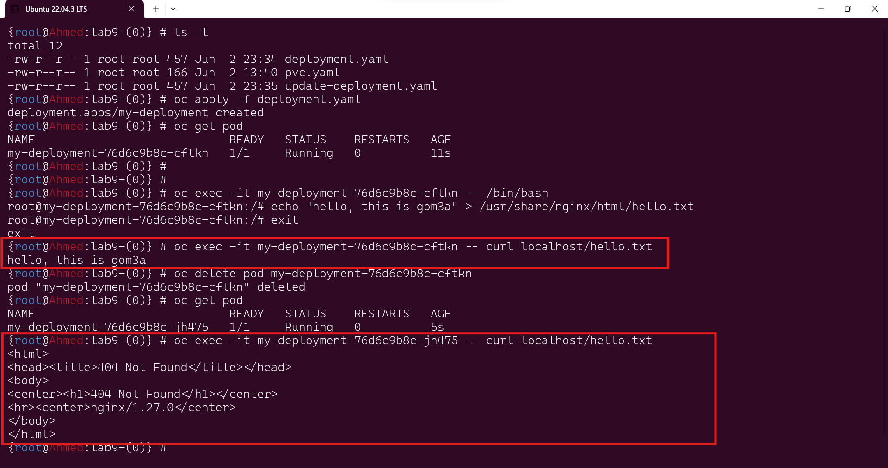
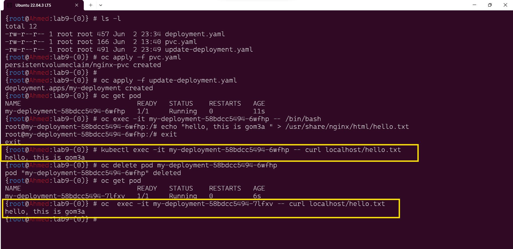

# Lab 9: Storage Configuration
## Overview
In this lab, you will learn about storage configuration in Kubernetes. You will create a Deployment named my-deployment with 1 replica using NGINX image. Then you will execute into the NGINX pod and create a file at /usr/share/nginx/html/hello.txt with the content "hello, this is ( your-name )".    
You'll verify that the file is served by NGINX using curl localhost/hello.txt. Next, you'll delete the NGINX pod and wait for the deployment to create a new pod. After that, you'll execute into the new pod and verify that the file at /usr/share/nginx/html/hello.txt is no longer present. Finally, you'll create a Persistent Volume Claim (PVC) and modify the deployment to attach the PVC to the pod at /usr/share/nginx/html. You'll repeat the previous steps and verify that the file persists across pod deletions.

## Table of Contents
- Compare Persistent Volume (PV), Persistent Volume Claim (PVC), and StorageClass
- Objective
- Prerequisites
- Lab Steps
    - Step 1: Create NGINX Deployment
    - Step 2: Verify File Serving
    - Step 3: Delete and Recreate Pod
    - Step 4: Create Persistent Volume Claim (PVC)
    - Step 5: Modify Deployment to Attach PVC
    - Step 6: Verify File Persistence
- Conclusion
- References
***
## Compare Persistent Volume (PV), Persistent Volume Claim (PVC), and StorageClass

| Feature                | Persistent Volume (PV)                   | Persistent Volume Claim (PVC)                 | StorageClass                              |
|------------------------|-------------------------------------------|-----------------------------------------------|-------------------------------------------|
| Definition             | Storage provisioned in the cluster        | Request for storage by a Pod                  | Defines storage types and provisioning   |
| Lifecycle              | Independent of Pods, exists until deleted | Bound to Pods, same lifecycle as Pods        | Managed by cluster admins, used by users |
| Creation               | Admin or dynamically provisioned          | Created by users                              | Created by cluster admins                 |
| Access Control         | Controlled by Kubernetes RBAC policies    | Controlled by Kubernetes RBAC policies       | Controlled by Kubernetes RBAC policies    |
| Usage Example          | Represent network-attached storage (NAS)  | Request specific storage for a Pod           | Provision PVs with specific characteristics|


## Objective
By the end of this lab, you will:

- Understand how to configure storage in Kubernetes using Persistent Volumes (PV), Persistent Volume Claims (PVC), and StorageClasses.
- Learn how to attach storage to a Pod to persist data across Pod recreations.

## Prerequisites
- Basic understanding of Kubernetes concepts.
- A running Kubernetes cluster.
- kubectl installed and configured to interact with your cluster.

## Lab Steps
### Step 1: Create NGINX Deployment
Create a Kubernetes Deployment named my-deployment with 1 replica using NGINX image from the deployment.yaml.

```yml
#deployment.yaml
apiVersion: apps/v1
kind: Deployment
metadata:
  name: my-deployment
spec:
  replicas: 1
  selector:
    matchLabels:
      app: nginx
  template:
    metadata:
      labels:
        app: nginx
    spec:
      containers:
      - name: nginx
        image: nginx
```

```bash
oc apply -f deployment.yaml
```
### Step 2: Verify File Serving
Execute into the NGINX pod and create a file at /usr/share/nginx/html/hello.txt with the content "hello, this is  your-name".
```bash
oc exec -it <nginx-pod-name> -- /bin/bash
echo "hello, this is <your-name>" > /usr/share/nginx/html/hello.txt
exit
```
Verify that the file is served by NGINX using curl localhost/hello.txt.

```sh
oc exec -it <nginx-pod-name> -- curl localhost/hello.txt
```
### Step 3: Delete and Recreate Pod
Delete the NGINX pod and wait for the deployment to create a new pod.
```bash
oc delete pod <nginx-pod-name>
```
and then try to show the contant in /usr/share/nginx/html/hello.txt 
it's not found



### Step 4: Create Persistent Volume Claim (PVC)
Create a Persistent Volume Claim (PVC).

```yml
# persistent-volume-claim.yaml
apiVersion: v1
kind: PersistentVolumeClaim
metadata:
  name: nginx-pvc
spec:
  accessModes:
  - ReadWriteOnce
  resources:
    requests:
      storage: 1Gi
```
```bash
oc apply -f persistent-volume-claim.yaml
```
### Step 5: Modify Deployment to Attach PVC
Modify the deployment to attach the PVC to the pod at /usr/share/nginx/html.

```yml
# udpate-deployment.yaml
apiVersion: apps/v1
kind: Deployment
metadata:
  name: my-deployment
spec:
  replicas: 1
  selector:
    matchLabels:
      app: nginx
  template:
    metadata:
      labels:
        app: nginx
    spec:
      containers:
      - name: nginx
        image: nginx
        volumeMounts:
        - name: nginx-storage
          mountPath: /usr/share/nginx/html
      volumes:
      - name: nginx-storage
        persistentVolumeClaim:
          claimName: nginx-pvc
```

```bash
oc apply -f my-deployment.yaml
``` 
Step 6: Verify File Persistence
Repeat the previous steps and verify that the file persists across pod deletions.

```sh
oc  exec -it <nginx-pod-name> -- curl localhost/hello.txt
```
the steps shown in the photo below


***
## Conclusion
In this lab, you learned about storage configuration in Kubernetes using Persistent Volumes (PV), Persistent Volume Claims (PVC), and StorageClasses. You successfully attached storage to a Pod to persist data across Pod recreations.

## References
- [Kubernetes Documentation - Persistent Volumes](https://kubernetes.io/docs/concepts/storage/persistent-volumes/)
- [Kubernetes Documentation - Persistent Volume Claims](https://kubernetes.io/docs/concepts/storage/persistent-volume-claims/)
- [Kubernetes Documentation - StorageClasses](https://kubernetes.io/docs/concepts/storage/storage-classes/)


