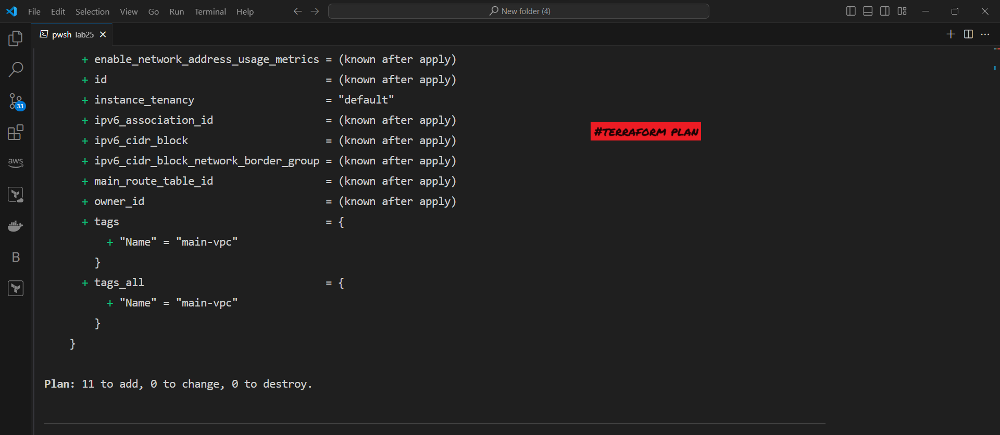

# Lab 25: Multi-Tier Application Deployment with Terraform modules
## Objective
The objective of this lab is to use Terraform to modules define and deploy a multi-tier architecture in AWS. This includes creating a VPC, public and private subnets, EC2 instances in the public subnet, and an RDS database in the private subnets.

## Architecture Overview


### The architecture deployed in this lab includes:
- modules
    - instance
        - EC2 and security
    - RDS
        - RDS MySQL database
    - VPC 
        - A VPC with a public and private subnet in each of two availability zones.
        - An Internet Gateway attached to the VPC.
        - A public route table associated with the public subnets.

## Prerequisites
- AWS Account with necessary permissions to create resources.
- AWS CLI configured with appropriate credentials.
- Terraform installed on your local machine.
- Basic understanding of Terraform and AWS services.


## Steps to Deploy

### Clone the Repository

```bash
Copy code
git clone https://github.com/gAhmedg/ivolve-traning.git
cd ivolve-traning/terraform/lab25
```
### Initialize Terraform

```bash
Copy code
terraform init
```


### Review the Plan

```bash
Copy code
terraform plan
```

### Apply the Configuration

```bash
Copy code
terraform apply
```


### Confirm the apply action when prompted.

## Verify the Deployment
After the apply process completes, you can verify the resources in the AWS Management Console.
 the instances created  in console
 

***
RDS Instances: Launches two RDS MySQL database instances, each in a different availability zone, using the defined subnet group.


***
## Cleanup
To destroy the resources created by this Terraform configuration, run:

```bash
Copy code
terraform destroy
```
Confirm the destroy action when prompted.

